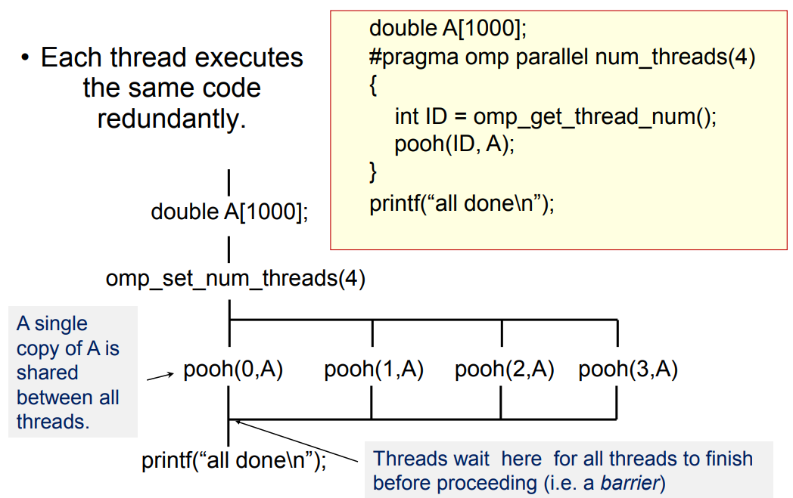
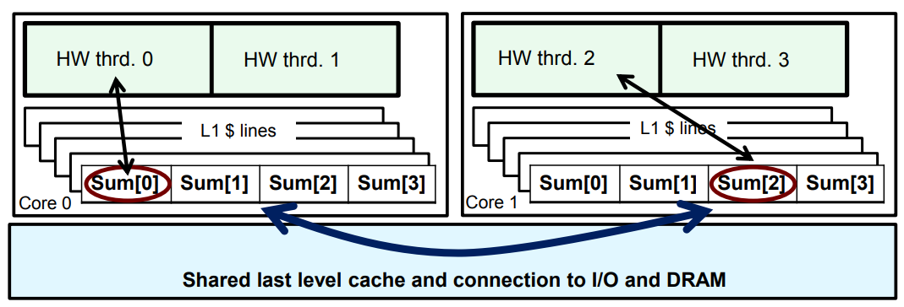

## OpenMP

### 1. Getting Start with OpenMP

OpenMP的大多数结构都是编译器指令，运行时函数原型和类型在头文件`omp.h`中。Linux gcc启用OpenMP时，需要加编译选项`-fopenmp`。
```c++
#pragma omp constuct [clause [clause] ...]

// eg. 启动4线程并行
#pragma omp parallel num_threads(4)
```

一个多线程打印hello world的程序。
```c++
// 编译命令 g++ -fopenmp main.cpp -o main
#include <stdio.h>
#include <omp.h>

int main()
{
    #pragma omp parallel num_threads(4)
    {
        int id = omp_get_thread_num();
        printf("hello(%d) ", id);
        printf("world(%d) ", id);
    }
    return 0;
}
```

OpenMP是一个多线程，共享地址模型，线程间通过共享变量来做交互。无意的数据共享可能会引起条件竞争，程序的结果会由于线程的调度方式不同而不同，如上面的程序中各个线程打印hello和world的时机在多次运行时会有差异。想要避免这个现象，需要使用同步来保护数据冲突的部分。同步操作是代价是昂贵的，改变数据的访问方式可以减小对同步的依赖。

一些常用的运行时库函数
- omp_set_num_threads() : 设置并行的线程数
- omp_get_num_threads() : 获取并行的线程数
- omp_get_thread_num() : 获取当前的线程编号rank
- omp_num_procs() : 获取当前CPU的核心数


### 2. OpenMP程序模型

OpenMP使用的Fork-Join并行模型，主线程根据需要生成一组线程，在各线程达到并行区域结束位置时，需要进行同步，等待其他线程完成。



```c++
#pragma omp parallel num_threads(4)
{
    foobar ();
}

// 编译后可能生成的代码
void thunk ()
{
    foobar ();
}

// 只会生成3个线程
pthread_t tid[4];
for (int i = 1; i < 4; ++i) {
    pthread_create (&tid[i],0,thunk, 0);
}
thunk();  // 主线程也会干活
for (int i = 1; i < 4; ++i) {
    pthread_join (tid[i]);
}
```

大多数OpenMP编译器的实现都会使用线程池，来避免频繁线程创建和销毁的开销。

### 3. PI计算程序的并行化示例

串行的PI计算程序

```c++
static long num_steps = 100000;
double step;
int main ()
{
    int i; double x, pi, sum = 0.0;
    step = 1.0/(double) num_steps;
    for (i=0;i< num_steps; i++){
        x = (i+0.5)*step;
        sum = sum + 4.0/(1.0+x*x);
    }
    pi = step * sum;

    return 0;
}
```

并行化的PI程序
```c++
#include <omp.h> 
static long num_steps = 100000; double step;
#define NUM_THREADS 2 
void main ()
{ 
    int i, nthreads; double pi, sum[NUM_THREADS];
    step = 1.0/(double) num_steps;
    omp_set_num_threads(NUM_THREADS); 
    #pragma omp parallel 
    { 
        int i, id,nthrds;
        double x;
        id = omp_get_thread_num();   // 获取当前的线程ID
        // 获取启用的线程数, 在某些策略下nthrds可能和NUM_THREADS不一致
        nthrds = omp_get_num_threads();
        // 只需要一个线程去更新nthreads这个共享变量, 避免多线程写变量出现冲突
        if (id == 0) nthreads = nthrds; 
        // SPMD(Single Program Multiple Data)中循环迭代任务分发的常用设计模式
        for (i=id, sum[id]=0.0;i< num_steps; i=i+nthrds) {
            x = (i+0.5)*step;
            sum[id] += 4.0/(1.0+x*x);
        }
    }
    for(i=0, pi=0.0;i<nthreads;i++)
        pi += sum[i] * step;

    return 0;
}
```

结果：串行程序耗时1.83s；并行程序单线程耗时1.86s，2线程耗时1.03s，4线程耗时0.97s。

为什么加速效果不理想？原因是出现了伪共享（False sharing）。

多线程更新位于相同缓存行上的变量时，会导致缓存在多线程之间频繁的失效和更新，导致性能下降，即为伪共享。在PI程序中，不同的线程会更新sum数组某一索引的值，导致其相邻元素的缓存也跟着失效。想要解决这个问题，可以填充数组，使不同线程访问的数组元素位于不同的缓存行。



消除伪共享后的并行PI程序
```c++
#include <omp.h>
static long num_steps = 100000; double step;
#define PAD 8 // 假设L1 cache line的大小为64字节
#define NUM_THREADS 2
void main ()
{ 
    int i, nthreads; double pi, sum[NUM_THREADS][PAD]; 
    step = 1.0/(double) num_steps;
    omp_set_num_threads(NUM_THREADS);
    #pragma omp parallel
    { 
        int i, id,nthrds;
        double x;
        id = omp_get_thread_num();
        nthrds = omp_get_num_threads();
        if (id == 0) nthreads = nthrds;
        for (i=id, sum[id]=0.0;i< num_steps; i=i+nthrds) {
            x = (i+0.5)*step;
            sum[id][0] += 4.0/(1.0+x*x);
        }
    }
    for(i=0, pi=0.0;i<nthreads;i++)pi += sum[i][0] * step;

    return 0;
}
```

加速效果：并行程序单线程耗时1.86s，2线程耗时1.01s，4线程耗时0.53s。

该方法的弊端：填充数组需要对缓存架构有深入的了解。当程序在其他具有不同缓存大小的机器上运行时，我们就得不到理想的性能。后面我们会介绍更好的方法来避免伪共享。


### 4. 线程同步

同步用于施加顺序约束和保护对共享数据的访问，两种最常见的同步形式：
- Barrier：屏障，每个线程都在barrier处等待，直到所有线程到达。
- Mutual exclusion：互斥，定义一个一次只能执行一个线程的代码块。

OpenMP提供的同步措施：barrier、critical、atomic、ordered、locks。

Barrier: 每个线程都需要等待所有线程完成。
```c++
#pragma omp parallel 
{
    int id=omp_get_thread_num();
    A[id] = big_calc1(id);

#pragma omp barrier
    B[id] = big_calc2(id, A);
}
```

critical: 同一时间只有一个线程能够进入临界区。
```c++
float res;
#pragma omp parallel
{ 
    float B; int i, id, nthrds;
    id = omp_get_thread_num();
    nthrds = omp_get_num_threads();
    for(i=id;i<niters;i+=nthrds){
        B = big_job(i);
#pragma omp critical
        res += consume (B);
    }
}
```

atomic: 提供互斥操作，但仅适用于更新内存区域。
```c++
#pragma omp parallel
{ 
    double tmp, B;
    B = DOIT();
    tmp = big_ugly(B);
#pragma omp atomic 
    X += tmp;
}
```

使用临界区原语来改进我们的并行PI程序。
```c++
#include <omp.h> 
static long num_steps = 100000; double step;
#define NUM_THREADS 2 
void main ()
{ 
    ouble pi; step = 1.0/(double) num_steps;
    omp_set_num_threads(NUM_THREADS); 
    #pragma omp parallel 
    {
        // sum是一个栈变量，为线程私有的，不会出现伪共享
        int i, id,nthrds; double x, sum;
        id = omp_get_thread_num();
        nthrds = omp_get_num_threads();
        if (id == 0) nthreads = nthrds; 
        id = omp_get_thread_num(); 
        nthrds = omp_get_num_threads(); 
        for (i=id, sum=0.0;i< num_steps; i=i+nthreads){
            x = (i+0.5)*step;
            sum += 4.0/(1.0+x*x);
        }
        sum *= step;
        // 临界区，每个线程计算完成之后将其sum值加到pi上
        // 使用atomic也可以, #pragma omp atomic
        #pragma omp critical 
        pi += sum;
    }

    return 0;
}
```

加速效果：并行程序单线程耗时1.87s，2线程耗时1.00s，4线程耗时0.53s。


### 5. loop worksharing构造式

loop worksharing构造式可以自动地将循环迭代切分到多个线程中执行。

```c++
#pragma omp parallel
{
#pragma omp for 
    for (I=0;I<N;I++){
        NEAT_STUFF(I);
    }
}

// 更简洁的写法
#pragma omp parallel for 
for (I=0;I<N;I++){
    NEAT_STUFF(I);
}
```

如果不使用for构造式，我们就需要手动的将循环切分为若干个，再放到各个omp线程中执行。

#### schedule子句

当for循环中每次迭代的计算量相差较大时，如果简单的为每次迭代分配相同的线程，就会导致线程任务不均衡，CPU资源没有被充分利用，影响程序执行性能。为了解决这样的负载严重不均衡的情况，OpenMP提供了几种对for循环并行化的任务调度方案，通过schedule子句来指定。

```c++
#pragma omp parallel for schedule ( type [,chunk] )
```

其中，type表示调度类型，可以有四种选择：dynamic、guided、runtime、static、auto，其实runtime是根据环境变量来选择其他三种中的某一种类型；chunk是可选的，表示连续循环迭代的次数，必须为整数，当type为runtime时候不需要chunk参数。未指定时，大部分系统中默认采用static调度方式。

- static：简单的根据迭代次数和chunk值，尽可能均匀的将迭代分配给各个线程。运行时调度开销最小的工作方式，用于迭代可预测或在编译时可确定的场景。
- dynamic：每个线程逐次从队列中抓取chunk个迭代块，直到完成所有的迭代。用于每个迭代任务不可预测或高度可变时。
- guided：线程动态的抓取迭代块，开始时块很大，后面逐渐缩小到chunk大小。用于特殊情况下动态的减少调度开销。
- runtime：通过环境变量OMP_SCHEDULE来确定schedule type和chunk，比如`setenv OMP_SCHEDULE "dynamic, 2"`。
- auto：schedule在运行时由系统自动选择。

测试case。
```c++
#include <stdio.h>
#include <omp.h>

int main()
{
#pragma omp parallel for schedule(static, 1) num_threads(4)
    for (int i=0; i<10; ++i)
    {
        printf("i=%d, thread_id=%d\n", i, omp_get_thread_num());
    }
    return 0;
}
```
#### 嵌套循环

对于完美嵌套的矩形循环，我们可以使用collapse子句在嵌套中并行化多个循环。

```c++
#pragma omp parallel for collapse(2)
for (int i=0; i<N; i++) {
    for (int j=0; j<M; j++) {
    .....
    } 
}
```

#### Reduction规约子句

```c++
reduction (op : list)
```

每个线程会创建一份list中变量的本地拷贝，并根据op操作对其进行初始化。循环中对list变量的更新均发生在本地副本上。在线程同步时，各个线程会将副本合并规约到原始的全局变量上。因此，list中的变量必须是在并行区域共享的。

继续改造我们的并行PI程序。

```c++
#include <omp.h>
static long num_steps = 100000; double step;
void main ()
{ 
    int i; double x, pi, sum = 0.0; 
    step = 1.0/(double) num_steps;
    #pragma omp parallel 
    {
        double x;
        #pragma omp for reduction(+:sum)
        for (i=0;i< num_steps; i++){
            x = (i+0.5)*step;
            sum = sum + 4.0/(1.0+x*x);
        }
    }
    pi = step * sum;

    return 0;
}
```

加速效果：并行程序单线程耗时1.91s，2线程耗时1.02s，4线程耗时0.68s。


### 6. 线程同步进阶

#### nowait子句

nowait子句一般用于for循环指令或sections指令中，用来取消任务完成后的隐式线程同步屏障，即线程在完成当前并行任务后无需等待其他线程是否完成。
```c++
#pragma omp parallel shared (A, B, C) private(id)
{
    id=omp_get_thread_num();
    A[id] = big_calc1(id);
    #pragma omp barrier
    #pragma omp for 
    for(i=0;i<N;i++)    {C[i]=big_calc3(i,A);}
    #pragma omp for nowait
    for(i=0;i<N;i++)    { B[i]=big_calc2(C, i); }
    A[id] = big_calc4(id);  // 线程在执行完上面的for循环后，不会等待其他线程，而是直接执行这条指令
}
```

#### master指令

master指令表示当前代码块只有主线程能够执行，其他线程将会跳过它，且不会等待主线程执行完成。
```c++
#pragma omp parallel 
{
    do_many_things();
    #pragma omp master
    { exchange_boundaries(); }
    #pragma omp barrier
    do_many_other_things();
}
```

#### single指令

single指令表示当前代码块只需要一个线程执行即可，且其他线程需要等待该线程执行完成，不过可以使用nowait子句取消这一行为。
```c++
#pragma omp parallel 
{
    do_many_things();
    #pragma omp single
    { exchange_boundaries(); }
    do_many_other_things();
}
```

#### sections指令

sections worksharing construt，每个section的代码块可以并行执行。sections代码块末尾会做隐式同步barrier，可以通过nowait子句取消这一行为。
```c++
#pragma omp parallel
{
    #pragma omp sections
    {
        #pragma omp section
        X_calculation();
        #pragma omp section
        y_calculation();
        #pragma omp section
        z_calculation();
    }
}
```

### 锁

OpenMP的运行时库有互斥锁和可重入锁的例程。
```c++
// 简单的互斥锁
omp_init_lock();
omp_set_lock(); 
omp_unset_lock();
omp_test_lock(); 
omp_destroy_lock();

// 可重入锁
omp_init_nest_lock();
omp_set_nest_lock();
omp_unset_nest_lock();
omp_test_nest_lock(); 
omp_destroy_nest_lock();
```

使用示例：
```c++
#pragma omp parallel for
for(i=0;i<NBUCKETS; i++){
    omp_init_lock(&hist_locks[i]); hist[i] = 0;
}
#pragma omp parallel for
for(i=0;i<NVALS;i++){
    ival = (int) sample(arr[i]);
    omp_set_lock(&hist_locks[ival]); 
    hist[ival]++;
    omp_unset_lock(&hist_locks[ival]);
 }
for(i=0;i<NBUCKETS; i++)
    omp_destroy_lock(&hist_locks[i]);
```

### 7. 数据环境

默认情况下，除了并行区域内的局部变量外，我们可以认为其他变量都是线程共享的。我们也可以通过shared、private、firstprivat、lastprivate子句来显示指定变量的属性。

private子句会在每个线程内创建一个变量的私有副本。私有副本是没有给定初始值的，可以使用firstprivate子句来指定使用共享变量的值来初始化私有副本。同时，私有副本的更新的值在并行结束后，也不会更新到共享变量中；我们可以使用lastprivate将最后一次迭代的私有副本的值更新到共享变量中。

```c++
// 错误示范
void wrong() {
    int tmp = 0;
    #pragma omp parallel for private(tmp)
    for (int j = 0; j < 1000; ++j) 
       tmp += j;  // tmp未初始化
    printf(“%d\n”, tmp); // 这里打印的是共享变量tmp的值, 为0
}

// firstprivate的使用
incr = 0;
#pragma omp parallel for firstprivate(incr)
for (i = 0; i <= MAX; i++) {
    if ((i%2)==0) incr++;  // 私有副本incr的值被初始化为0
    A[i] = incr;
}

// lastprivate的使用
void sq2(int n, double *lastterm)
{
    double x; int i;
    #pragma omp parallel for lastprivate(x)
    for (i = 0; i < n; i++){
        x = a[i]*a[i] + b[i]*b[i];
        b[i] = sqrt(x);
    }
    *lastterm = x;  // i==n-1时的x的值, 被更新到了共享变量x中了
}
```

在编写OpenMP程序时，我们可能会因为忘记某个变量是共享或私有的，而导致计算结果错误。一个有用的调试方法就是使用default(none)子句，强制要求程序员明确指定并行区域中的共享变量。如果没有将变量明确声明为共享或私有的，则会导致编译错误，从而防止意外的共享状态访问问题。

```c++
int main() {
    int shared_var = 0;
    int private_var = 0;
    #pragma omp parallel default(none) shared(shared_var) private(private_var)
    {
        // 使用 shared_var 进行读写操作
        // 使用 private_var 进行线程私有的读写操作
    }
    return 0;
}
```
