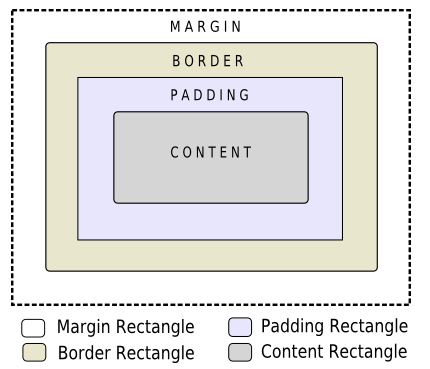

# Qt之样式表QSS

Qt样式表是一个可以自定义部件外观的十分强大的机制，可以用来美化部件。Qt样式表的概念、术语和语法都受到了HTML的层叠样式表（Cascading Style Sheets, CSS)的启发，不过与CSS不同的是，Qt样式表应用于部件的世界。

QSS的主要功能是使界面的表现与界面的元素分离，使得设计皮肤与界面控件分离的软件成为可能。

样式表使用文本描述，可以使用 QApplication:: setStyleSheet() 函数将其设置到整个应用程序上，也可以使用 QWidget::setStyleSheet() 函数将其设置到一个指定的部件（还有它的子部件）上。如果在不同的级别都设置了样式表，那么Qt会使用所有有效的样式表，这被称为样式表的层叠。

```C++
ui->pushButton->setStyleSheet("background:yellow");
```

我们也可以将样式表保存在文件中，然后在代码中加载样式表文件，这样更方便管理样式表。

```C++
QPushButton *button = new QPushButton(this);
button->setText("hello");
QFile file(":/qss/dev.qss");
file.open(QIODevice::ReadOnly);
QString stylesheet = QLatin1String(file.readAll());
button->setStyleSheet(stylesheet);
file.close();
```

## 1. 样式表语法

### 1.1 样式规则

QSS包含了一个样式规则序列，一个样式规则由一个选择器和声明组成，选择器指定哪些部件由规则影响，声明指定哪些属性应该在部件上进行设置。例如：

```css
QPushButton { color: red }
```

上面的例子中QPushButton是选择器，{ color: red }是声明，该规则指定QPushButton及其子类（例如：MyPushButton）应使用红色作为前景色。

QSS通常不区分大小写（即：color、Color、COLOR、cOloR指同一属性），唯一例外就是类名（class names）、对象名（object names）、属性名（property names）区分大小写。

几个选择器可以指定相同的声明，使用逗号（,）来分隔选择器。例如：

```css
QPushButton, QLineEdit, QComboBox { color: red }
```

声明部分的规则是一个属性值对（property: value）列表，包含在花括号中，以分号分隔。例如：

```css
QPushButton { color: red; background-color: white }
```

### 1.2 选择器类型

目前为止，所有的示例使用选择器中最简单的类型，类型选择器。QSS支持所有的[selectors defined in CSS2](https://www.w3.org/TR/REC-CSS2/selector.html)。下表总结了最有用的类型选择器。

|   选择器   |            示例             | 说明                                                         |
| :--------: | :-------------------------: | ------------------------------------------------------------ |
| 通用选择器 |             \*              | 匹配所有部件                                                 |
| 类型选择器 |         QPushButton         | 匹配QPushButton及其子类的实例                                |
| 属性选择器 | QPushButton\[flat=”false”\] | 匹配QPushButton中flat属性为false的实例。可以用此选择器来测试任何支持`QVariant::toString()`的属性，此外，支持特殊的类属性、类名称。此选择器也可以用来测试动态属性。还可以使用~=替换=，测试QStringList类型的属性是否包含给定的QString。 警告：如果Qt属性值在设置样式之后更改，那么可能需要强制重新计算样式。实现的一个方法是取消样式，然后重新设置一遍。 |
|  类选择器  |        .QPushButton         | 匹配QPushButton的实例，但不包含子类。相当于\*\[class~=”QPushButton”\]。 |
|  ID选择器  |    QPushButton#okButton     | 匹配所有objectName为okButton的QPushButton实例。              |
| 后代选择器 |     QDialog QPushButton     | 匹配属于QDialog后代（孩子，孙子等）的QPushButton所有实例。   |
|  子选择器  |    QDialog > QPushButton    | 匹配属于QDialog直接子类的QPushButton所有实例。               |

### 1.3 子控件

对于样式复杂的部件，需要访问子控件，例如：QComboBox的下拉按钮或QSpinBox的上下箭头。选择器可能包含子控件，使得可以限制特有部件子控件的应用规则。例如：

```css
QComboBox::drop-down { image : url(dropdown.png) }
```

上述规则指定了QComboBoxe下拉按钮样式，虽然双冒号（::）语法让人想起CSS3伪元素，但Qt子控件从概念上讲有不同的级联语义。

子控件定位总是相对于另一个参考元素。这个参考元素可能是小部件或其它子控件。例如：QComboBox的::drop-down放置，默认的放置在QComboBox区域的右上角，::drop-down放置，默认的在::drop-down子控件的内容矩形的中心。

可以使用subcontrol-origin改变子控件原始的默认位置，下拉的对齐方式可以通过subcontrol-position属性改变。

```css
QComboBox {
    margin-right: 20px;
}
QComboBox::drop-down {
    subcontrol-origin: margin;
}
```

width和height属性可用于控制子控件的大小，注意：设置一个图片会隐式地设置子控件的大小。

相对定位（position : relative）：可以改变子控件相对初始位置的偏移量。例如：按下QComboBox下拉按钮时，我们可能更喜欢用内部箭头偏移量来产生一个被按下的效果。要做到这一点，我们可以指定：

```Qt
QComboBox::down-arrow {
    image: url(down_arrow.png);
}
QComboBox::down-arrow:pressed {
    position: relative;
    top: 1px; left: 1px;
}
```

绝对定位（position : absolute）：允许子控件改变位置和的大小而不受参考元素限制。一旦位置被设定，这些子控件将被和普通部件（widgets）视为相同，并且可以使用盒模型样式。

注意：对于复杂的部件，如：QComboBox和QScrollBar，如果一个属性或子控件被定制，所有其它属性或子控件必须被定制好。

### 1.4 伪选择器

选择器可以包含伪状态，意味着限制基于部件状态的应用程序规则。伪状态出现在选择器后面，用冒号（:）关联。例如，鼠标划过按钮：

```css
QPushButton:hover { color: white }
```

伪状态可以用感叹号（!）运算符表示否定。例如，当鼠标不划过QRadioButton：

```css
QRadioButton:!hover { color: red }
```

伪状态可以连接使用，这种情况下，相当于隐含了一个逻辑与。例如，当鼠标滑过选中的QCheckBox：

```css
QCheckBox:hover:checked { color: white }
```

否定的伪状态也可以连接使用，例如，当鼠标划过一个非按下时按钮：

```css
QPushButton:hover:!pressed { color: blue; }
```

如果需要，也可以使用逗号操作来表示逻辑或：

```css
QCheckBox:hover, QCheckBox:checked { color: white }
```

伪状态也可以与子控件组合，例如：

```css
QComboBox::drop-down:hover { image: url(dropdown_bright.png) }
```

常用状态列举如下：

- disabled                   禁用的窗口部件
- enabled                    启用的窗口部件
- focus                         窗口部件有输入焦点
- hover                        鼠标在窗口部件上悬停
- pressed                    鼠标按键点击窗口部件
- checked                    按钮已被选中
- unchecked                按钮未被选中
- indeterminate          按钮被部分选中
- open                          窗口部件处于打开或扩展的状态
- closed                        窗口部件处于关闭或销毁状态
- on                               窗口部件的状态是on
- off                               窗口部件的状态是off

### 1.5 冲突处理

当样式中指定相同的属性具有不同的值时，就会出现冲突。例如：

```Qt
QPushButton#okButton { color: gray }
QPushButton { color: red }
```

两个规则匹配objectName为okButton的QPushButton实例，color属性有冲突。要解决这个冲突，必须考虑到的选择器的特殊性。上面的例子，QPushButton＃okButton被认为比QPushButton更具体，因为它通常是指单个对象，而不是一类的所有实例。

同样的，利用伪状态比不指定伪状态那些选择器更具体。因此，下面的样式指定一个QPushButton应该有鼠标悬停文本白色，否则文本红色效果：

```Qt
QPushButton:hover { color: white }
QPushButton { color: red }
```

这里有一个复杂的：

```Qt
QPushButton:hover { color: white }
QPushButton:enabled { color: red }
```

这里，两个选择器有相同的特殊性，如果鼠标在按钮上时，第二条规则优先。如果在这种情况下我们想要白色文本，需要重新排序规则：

```Qt
QPushButton:enabled { color: red }
QPushButton:hover { color: white }
```

或者，可以使第一条规则更加具体：

```Qt
QPushButton:hover:enabled { color: white }
QPushButton:enabled { color: red }
```

类似的问题出现在类型选择器一起使用。请看下面的例子：

```Qt
QPushButton { color: red }
QAbstractButton { color: gray }
```

两个规则应用于QPushButton实例（因为QPushButton继承自QAbstractButton）并有color属性的冲突。因为QPushButton继承QAbstractButton，所以QPushButton比QAbstractButton更具体。

然而，对于QSS的计算，所有的类型选择具有相同的特殊性，最后出现的规则优先。换句话说，所有的QAbstractButton颜色设置为灰色（包括QPushButton）。如果需要设置QPushButtons为红色文字，我们总能重新排序规则。

为了确定一个规则的特殊性，QSS遵循[CSS2规范](https://www.w3.org/TR/REC-CSS2/cascade.html#specificity)：

一个选择器的特殊性的计算方法如下：

- 计算选择器中ID属性的数量（= a）
- 计算选择器中伪状态类和其它属性的数量（= b）
- 计算选择器中元素名的数量（= c）
- 忽略伪元素（即子控件）。

串联的三个数字a-b-c（在具有大基数的数字系统）给出的特殊性。

一些例子：

```css
*             {}  /* a=0 b=0 c=0 -> specificity =   0 */
LI            {}  /* a=0 b=0 c=1 -> specificity =   1 */
UL LI         {}  /* a=0 b=0 c=2 -> specificity =   2 */
UL OL+LI      {}  /* a=0 b=0 c=3 -> specificity =   3 */
H1 + *[REL=up]{}  /* a=0 b=1 c=1 -> specificity =  11 */
UL OL LI.red  {}  /* a=0 b=1 c=3 -> specificity =  13 */
LI.red.level  {}  /* a=0 b=2 c=1 -> specificity =  21 */
#x34y         {}  /* a=1 b=0 c=0 -> specificity = 100 */
```

### 1.6 级联效应

QSS可以在QApplication、父部件、子部件中设置。任意部件的有效样式表通过合并部件的祖先（父亲，祖父等）以及任何QApplication上设置的样式表。

冲突发生时，不论冲突规则的特殊性，部件自身的样式表总优先于任何继承样式表。同样，父窗口部件样式表优先于祖父等。

这样，一个部件设置样式自动使得它比在祖先部件或QApplication的样式表中指定的其它规则的优先级高。考虑下面的例子。首先，我们在QApplication中设置样式表：

```Qt
qApp->setStyleSheet("QPushButton { color: white }");
```

然后，我们设置QPushButton的样式表：

```Qt
myPushButton->setStyleSheet("* { color: blue }");
```

QPushButton样式表强制QPushButton（以及任何子部件）显示蓝色文字，尽管应用程序范围内的样式表提供的规则更具体。

如果按照下面这种方式写，其结果是相同的：

```Qt
myPushButton->setStyleSheet("color: blue");
```

但如果QPushButton有孩子(不太可能)，样式表就不会对它们有效果。

### 1.7 继承性

在经典的CSS中，当字体和颜色没有明确设置时，它就会自动从父继承。当使用QSS时，部件不会自动从父继承字体和颜色。

例如，一个QGroupBox中包含QPushButton：

```Qt
qApp->setStyleSheet("QGroupBox { color: red; } ");
```

QPushButton没有一个明确的颜色设置，因此，不是继承其父QGroupBox的颜色，而是显示系统的颜色。如果要建立一个QGroupBox及其孩子的颜色，可以这样写：

```Qt
qApp->setStyleSheet("QGroupBox, QGroupBox * { color: red; }");
```

相比之下，可以用QWidget::setFont() 和 QWidget::setPalette()为子部件设置字体和画板 。

### 1.8 命名空间中的部件

类型选择器可用于某一特定类型的部件。例如：

```c++
class MyPushButton : public QPushButton {
    // ...
}

// ...
qApp->setStyleSheet("MyPushButton { background: yellow; }");
```

QSS使用部件的QObject::className()来确定何时应用类型选择器。当自定义的部件在命名空间中时，QObject::className()返回`<namespace>::<classname>`。这与子控件的语法冲突。为了解决这个问题，当命名空间内的部件使用类型选择器时，必须更换”::” 为 “–”。 例如：

```c++
namespace ns {
    class MyPushButton : public QPushButton {
        // ...
    }
}

// ...
qApp->setStyleSheet("ns--MyPushButton { background: yellow; }");
```

### 1.9 设置QObject属性

从4.3及以后，任何可被识别的Q_PROPERTY都可以使用`qproperty-<property name>`语法设置。

例如：

```css
MyLabel { qproperty-pixmap: url(pixmap.png); }
MyGroupBox { qproperty-titleColor: rgb(100, 200, 100); }
QPushButton { qproperty-iconSize: 20px 20px; }
```

如果属性引用Q_ENUMS声明的枚举，则应该参考其常量的名字，而不是数值。

### 1.10 盒子模型介绍

使用Style Sheets时,所有的部件都被视为有四个同心矩形的盒子(box)：边缘矩形(margin rectangle)，边框矩形(border rectangle)，填充矩形(padding rectangle)和内容矩形(content rectangle)。盒子模型对四个矩形有详细的描述，如下图所示：



边缘，边框宽度和填充属性默认为0。这样四个矩形(margin, border, padding和content)重合。

使用background-image属性，你可以为部件指定背景图片。默认地，背景图片只画在边框以内。背景图片不随部件大小改变而改变。提供一个随部件大小改变而改变的背景或皮肤，必须使用border-image。因为border-image属性提供了一个备选背景，所以并不需要再为部件指定一个背景图片。在两者都指定的情况下，border-image将画于background-image之上。


## 2. 样式表使用实例

### 2.1 使用动态属性定制

属性是指窗口或控件的属性，比如opacity属性表示“透明度”，geometry指的是“位置和大小”，pos属性代表“位置”。qt中的控件有自带的属性，我们也可以自己定义属性。QObject这个类有一个函数setProperty，我们可以通过这个函数定义自己的属性。对于继承自QObject的类，可以使用`Q_PROPERTY`宏来自定义属性。

```C++
// Q_PROPERTY(参数类型 参数名称 READ 获得属性值函数 WRITE 设置属性值函数)
Q_PROPERTY(bool focus READ hasFocus) 
Q_PROPERTY(bool enabled READ isEnabled WRITE setEnabled)
Q_PROPERTY(QColor color MEMBER m_color NOTIFY colorChanged)
```

目前所知的自定义属性有两个用途，第一是用于改变样式，第二是用于动画。这里举例说明下改变样式表的用法。

我们有个QWidget类，名字叫PropertyTest，界面中有一个按钮叫pushButton。按钮默认样式是blue蓝色，通过改变类PropertyTest的属性borderColor值改变按钮的颜色。

```css
#pushButton{border:4px solid blue;}
PropertyTest[borderColor="red"] #pushButton{border:4px solid red;}
PropertyTest[borderColor="green"] #pushButton{border:4px solid green;}
PropertyTest[borderColor="blue"] #pushButton{border:4px solid blue;}
```

在PropertyTest类中，我们需要定义自定义属性，并使用一个成员变量保存属性的值，通过set和get函数分别设置和获得该值。

```C++
Q_PROPERTY(QString borderColor READ getBorderColor WRITE setBorderColor)
    
private:    
	QString m_strBorderColor;
private:    
	void setBorderColor(const QString &strBorderColor) { 
        m_strBorderColor = strBorderColor; 
    }   
	QString getBorderColor(){ return m_strBorderColor; }
```

单击按钮pushButton改变属性值，从而改变按钮pushButton的样式。

```C++
void PropertyTest::changeBorderColor()
{
    if (m_iTest % 3 == 0)    
    {        
    	setBorderColor("red");    
    }    
    else if (m_iTest % 3 == 1)   
	{        
		setBorderColor("green");    
	}    
	else   
	{        
		setBorderColor("blue");    
	}    
	style()->unpolish(ui.pushButton_3);    
	style()->polish(ui.pushButton_3);    
	update();    
	m_iTest++;
}
```

最后要注意的是，上面代码中的unpolish和polish部分。在Qt文档中有个提醒，在使用属性选择器时，如果之前控件有其它样式，那么需要重写设置一下，“**旧的不去，新的不来**”，通过**unpolish**和**polish**抹去旧的样式，涂上新的样式。


## 3. 样式表模板

