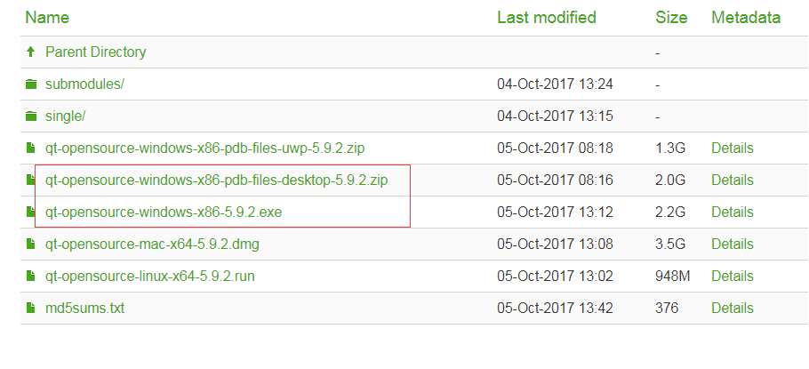
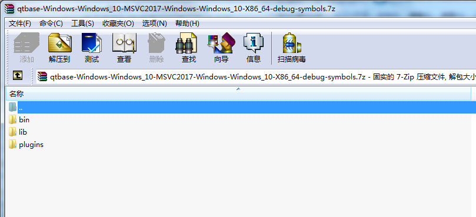
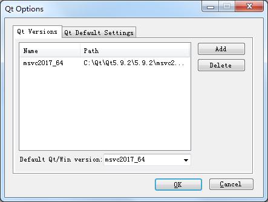
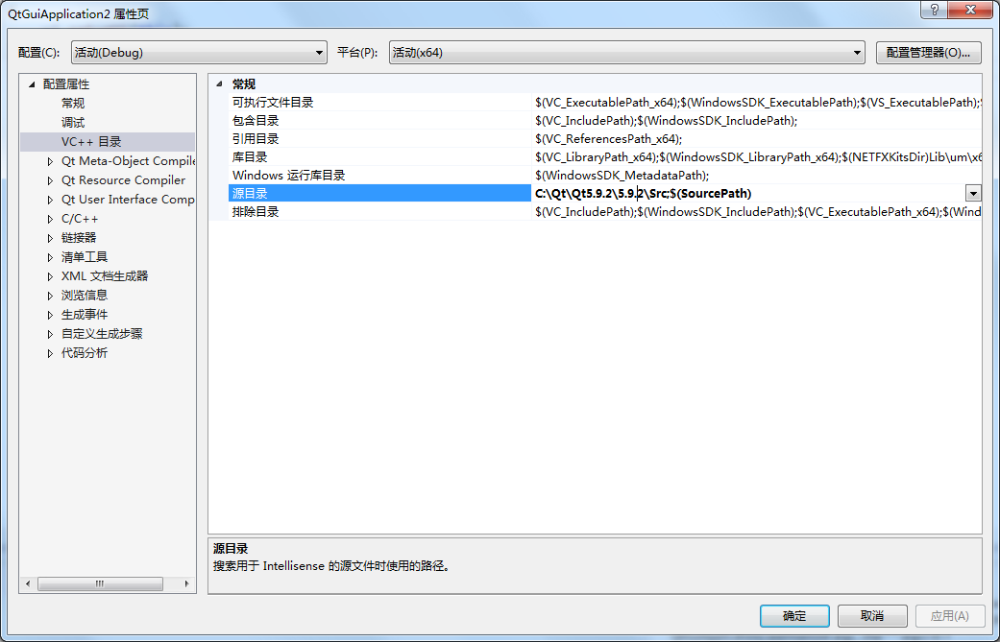
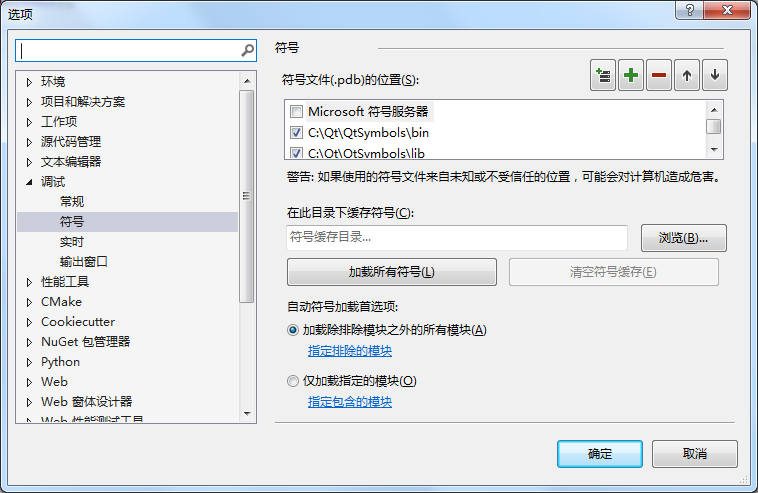
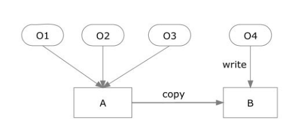

# Qt学习

## 基于VS2017搭建Qt源码调试环境

### 1. 安装下载Qt附带源码的安装包及Qt符号文件

下载目录：<http://download.qt.io/official_releases/qt/5.9/5.9.2/>



安装时，在“选择组件”的设置界面勾选“Sources”，以附带解压源码。符号文件解压对应VS版本的文件即可，解压至任意目录，在后续指定符号文件路径即可。这里我们仅解压了VS2017版本的qtbase库的调试文件，解压至Qt安装的路径，方便管理。



### 2. 配置VS2017的Qt开发环境

下载安装插件Qt Visual Studio Tools，VS2017可以在“工具 → 扩展和更新 → 联机”中搜索并安装该插件。安装好后在“Qt VS Tools → Qt options”中配置好对应的安装版本。



### 3. 添加Qt源码路径及符号文件路径

在项目属性页中配置好Qt源码路径。过程：项目 → 属性 → VC++目录 →源目录。



在选项页添加符号文件路径。过程：调试 → 选项 → 符号、




## 解析命令行参数获取

我们使用 Python 写个简单的脚本很方便，直接 `import argparse` 就能很容易的实现命令行参数解析的功能，还可以通过 `--help` 来输出帮助功能，而 Qt5 页提供了这方面的支持。

Qt 从 Qt5.2之后提供了 `QCommandLineParser` 和 `QCommandLineOption` 两个类来负责这个功能。

`QCoreApplication` 提供了方法用一个简单的 String 队列来获取参数；`QCommandLineParser` 提供了定义一些选项、复制命令行参数、储存实际有必要的参数的能力。如果一个参数不是一个选项，那么它会被认为是`positional argument`. `QCommandLineParser` 可以处理短名称`-a`、长名称`--all`、多个名称、选项值等。

命令行的选型是由 ‘-‘ 或 “–” 开头的字符串。短选项是’-a’，只有一个字母，通常表示标准输入。有的时候也会写成紧凑样式，比如`-a -b -c `表示三个选项，`-abc`也表示三个短选项，只有当你设置 `QCommandLineParser` 的模式为 `ParseAsLongOptions` 时，`-abc` 才表示维长选项。

长选项多余两个字母长，并且不可以写成紧凑样式，例如 `verbose` 写为`-verbose 或 --verbose`而且写错了并不会自动纠正。

在选项后面赋值有两种方式，一种是空格符间隔将值跟在选项后面，另一种是选项紧跟’=’号和值。例如:`-v=value --verbose=value` 或者是 `-v value --verbose value`。

而且经过我的测试，Qt 的这个工具获得的值只能是 QString 类型，也就是说，如果你需要的是 `int double float` 之类的参数，你需要通过其他的函数自己进行转换。

```C++
int main(int argc, char *argv[])
{
    QApplication a(argc, argv);

    QCommandLineParser parser;
    parser.setApplicationDescription("Test helper");
    parser.addHelpOption();
    parser.addOptions({
        // A boolean option with a single name (-p)
        {"p", 
         QCoreApplication::translate("main", "Show progress during copy")},
        // A boolean option with multiple names (-f, --force)
        {{"f", "force"},
         QCoreApplication::translate("main", "Overwrite existing files.")},
        // An option with a value
        {{"t", "target-directory"},
         QCoreApplication::translate("main", "Copy all source files into <directory>."),
         QCoreApplication::translate("main", "directory")},
    });

    parser.process(a);
    if (parser.isSet("force"))
    {
        printf("force commandline!\n");
    }

    if (parser.isSet("t"))
    {
        QString dir = parser.value("t");
        printf("t commandline %s\n", dir.toStdString().c_str());
    }

    QtGuiApplication2 w;
    w.show();
    return a.exec();
}
```


- `QCommandLineParser::process`函数从` QCoreApplication`类型的入参载入并解析命令行参数。

```C++
void QCommandLineParser::process(const QCoreApplication &app)
```

- `QCommandLineParser::isSet`函数可以帮助我们判断启动项是否包含指定的选项；如果包含则返回true，否则返回false；入参可以是长选项名，也可以是短选项名。其有两个声明：

```C++
bool QCommandLineParser::isSet(const QString &name) const;
bool QCommandLineParser::isSet(const QCommandLineOption &option) const;
```

一般使用第一个声明较为简单方便。

```C++
bool verbose = parser.isSet("verbose");
if(verbose) { 
    // do something 
}
```

- `QCommandLineParser::value`函数可以获取指定选项的选项值，如果未找到该选项，则返回空字符串。声明如下：

```C++
QString QCommandLineParser::value(const QString &optionName) const;
QString QCommandLineParser::value(const QCommandLineOption &option) const;
```


## 隐式共享与d-pointer技术

一般情况下，一个类的多个对象所占用的内存是相互独立的。如果其中某些对象数据成员的取值完全相同，我们可以令它们共享一块内存以节省空间。只有当程序需要修改其中某个对象的数据成员时，我们再为该对象分配新的内存。这种技术被称为隐式共享（implicit sharing）。

通常情况下，与一个类密切相关的数据会被作为数据成员直接定义在该类中。然而，在某些场合下，我们会将这些数据从该类（被称为公类）分离出来，定义在一个单独的类中（被称为私类）。公类中会定义一个指针，指向私类的对象。在计算机的发展历史中，这种模式被称为pointer to implementation (pimpl)，handle/body或者cheshire cat。这种模式起初由Trolltech公司的职员Arnt Gulbrandsen引入到Qt中。由于这个指针实质上指向了一个类的数据，Qt程序员常将其命名为d_ptr或者d。Qt文档以及本书将其称为d-pointer。

### 1. 隐式共享

隐式共享的目的在于节省内存、提高程序运行速度。如图所示，设对象O1、O2、O3的部分数据成员具有相同的取值。为了节省内存，我们用一个内存块A来存放这些数据成员，每个对象内部有一个指针，指向这个内存块。设此时有一个O3来复制构造O4的操作。由于O4和O3此时具有相同的数据成员，所以O4也可以和O1～O3共享内存块A。此后，程序请求修改O4的数据成员。由于逻辑上O1、O2、O3、O4是相互独立的对象，所以我们不能够直接修改内存块A中的数据，否则，会影响O1～O3的数据。内存块A中的数据被复制到一个新的内存块B，对O4的修改会施加到内存块B中存放的数据。这就是所谓“写时复制（copy-on-write）”名称的来源。这种技术能够在逻辑上保证各个对象是相互独立的。同时，在物理实现上，只要某些对象的数据成员值相同，则它们就会共享内存，以节省内存资源。



当然，采用这种技术需要一些额外的内存管理工作。设想客户要析构对象O3。我们不能够简单地将O3所用的内存块A释放，因为O1、O2还在使用这个内存块。当只有一个对象使用内存块A时，在析构该对象时才可以释放内存块A。为此，我们需要维护一个引用计数（reference counter）。每当有一个新的对象需要共享该内存块时，该内存块对应的引用计数被加1，每当共享该内存块的一个对象被析构时，该引用计数被减1。如果引用计数减为0，则说明已经没有任何对象需要使用该内存块，该内存块被释放。

### 2. d-pointer在隐式共享中的应用

直接定义一个类的数据成员无法实现隐式共享。为了能够共享数据，我们必须将类中的数据分离出来，定义在一个单独的类中，再定义一个指针指向这个新类。这个指针就被称为d-pointer，这个模式就被称为d-pointer模式。包含有d-pointer的那个类被称为主类，d-pointer所指的那个类被称为从类。Qt常在主类的名字后面加上后缀“Private”或者“Data”形成从类的名字。

下面代码定义了一个3*3的矩阵。矩阵数据实际存放在从类MatrixData中。如果多个主类对象具有完全相同的矩阵元素，这些对象共享一个从类对象。从类对象的数据成员m_refCount记录着有多少个主类对象共享该从类对象。主类的复制构造函数令新创建的主类对象共享已有的从类对象，只有当用户使用形如“matrix(row,col)”方式对矩阵第row行、第col列元素进行访问时，重载后的“()”运算符才会调用detach函数为一个主类对象创建新的从类对象。

```C++
class Matrix
{
    class MatrixData
    {
    public:
        int m_refCount;
        double data[3][3];
        MatrixData() { memset(data, 0, sizeof(data)); }
    };

public:
    Matrix()
    {
        d = new MatrixData;
        d->m_refCount = 1;
    }

    Matrix(const Matrix& other)
    {
        d = other.d;
        d->m_refCount++;
    }

    ~Matrix()
    {
        d->m_refCount--;
        if (d->m_refCount == 0)    delete d;
    }

    double& operator() (int row, int col)
    {
        detach();
        return d->data[row][col];
    }

    void detach()
    {
        if (d->m_refCount <= 1) return;
        d->m_refCount--;
        d = new MatrixData(*d);
        d->m_refCount = 1;
    }

private:
    MatrixData* d;
};

int main()
{
    Matrix m1;
    Matrix m2(m1), m3(m1);
    m3(0, 0) = 10;
}
```

### 3. 二进制代码兼容

一个Qt应用程序可以使用静态链接或者动态链接方式和Qt库链接。所谓静态链接，是指所有被调用的Qt函数的代码都会被包含在应用程序的可执行代码文件中。应用程序可以直接运行，不再需要其他软件模块。而动态链接是指被调用的Qt函数的代码被封装在一些共享库中。当应用程序运行时，将当前被调用的Qt函数的代码从该共享库中读取出来，加载到内存中再执行。在Windows操作系统中，共享库常常以动态链接库（Dynamically Linked Library，DLL）形式出现。以默认参数编译Qt源代码得到的是以动态链接方式的Qt库。所生成的DLL存放在q:\lib目录下。

采用动态链接方式有以下优点：

1. 节省存储空间。如果一个计算机系统中含有多个Qt应用程序，这些应用程序可以共享动态链接库中的函数代码，不必在每个应用程序的可执行文件中重复存放Qt函数代码。另外，仅当某个Qt函数被执行时，其代码才会被调入到内存中，这也节省了内存空间。
2. 有利于Qt库的部署。如果采用静态链接方式，每当Qt库的源代码更新时，需要重新编译每个Qt应用程序，再将应用程序部署到客户机器上。而采用动态链接方式时，客户只需要更新Qt的动态链接库，不需要重新编译、部署Qt应用程序。如果在这种情形下这些Qt应用程序仍然能够正常工作，我们称这个动态链接库是二进制兼容的（binary compatible）。

C++程序员需要遵守很多规则才可以保证一个动态链接库是二进制兼容的。其中一条规则如下。程序员在更新一个库的源代码时，可以自由地更改私类的数据成员，包括添加新的数据成员，删除原有的数据成员，调整数据成员的定义顺序，更改数据成员的数据类型，这些更改不会破坏该库的二进制兼容性。但是，对于公类，程序员只可以添加新的静态数据成员（static datamembers），不可以更改非静态的数据成员（non-static data members）。也就是说，程序员不可以添加、删除非静态数据成员，不可以更改非静态数据成员的定义顺序、类型。

C++库开发者可以利用d-pointer技术，将本应属于公有类的数据成员剥离出来放置到另一个私有类中。而共有类持有这个私有类的指针，通过该指针访问私有类的数据成员。更新库源代码时，开发者可以自由变更私有类中的数据而不必担心破坏库的二进制兼容性。

## 事件处理

事件（event）是由窗口系统或者Qt自身产生的，用于响应所发生的各类事情。当用户按下或者松开键盘或鼠标上的按键时，就可以产生一个键盘或者鼠标事件。在使用Qt编程开发时， 基本不需要考虑事件，因为发生某些重要的事情时，Qt窗口部件都会发射信号。但是，当我们需要编写自定义窗口部件，或者希望改变已存在的Qt窗口部件的行为时，事件就变得非常有用了。

在Qt中，事件是作为对象处理的，所有事件对象继承自抽象类QEvent。当一个事件产生时，Qt 通过实例化一个 QEvent 的合适的子类来表示它，然后通过调用 event() 函数发送给 QObject 的实例（或者它的子类）。event() 函数本身并不会处理事件，而是根据事件类型调用相应的事件处理函数，并且返回事件被接受还是被忽略。

大部分事件类型有专门的类，比如 QResizeEvent, QPaintEvent, QMouseEvent, QKeyEvent 和 QCloseEvent。它们都是 QEvent 的子类，并且添加了自己特定的事件处理函数。比如 QResizeEvent 事件添加了 size()和 oldSize() 函数，使组件获知自身大小的改变。

每一个事件都有其相关联的类型，由 QEvent::Type 定义。我们能够很方便地在运行时用这些类型来判断该事件是哪一个子类。

通常我们可以通过重写事件处理的虚函数，来实现自定义需求。如果你想代替基类的处理，你必须自己实现所有的功能。但是，如果你只想扩展子基类的功能，你只需要实现你自己需要的那部分，剩下的让基类来替你处理。如下面示例展示的功能：处理鼠标左键点击一个自定义的选择框的操作，而其他的点击事件则被传递给基类 QCheckBox 处理。

```C++
void MyCheckBox::mousePressEvent(QMouseEvent *event)
{
    if (event->button() == Qt::LeftButton) {
        // handle left mouse button here
    } else {
        // pass on other buttons to base class
        QCheckBox::mousePressEvent(event);
    }
}
```

### 鼠标事件响应

重写鼠标事件响应函数：

```C++
void mouseMoveEvent(QMouseEvent *e);
void mousePressEvent(QMouseEvent *e);
void mouseReleaseEvent(QMouseEvent *e);
void mouseDoubleClickEvent(QMouseEvent *e);
```

窗口类方法`setMouseTracking`可以设置窗体是否追踪鼠标。默认为false，即不追踪，在此情况下应至少有一个鼠标按键按下时，才响应鼠标移动事件。

`QMouseEvent`一般只涉及鼠标左键或右键的单击、释放等操作，而对鼠标滚轮的响应则通过`QWheeEvent`来处理。当在一个窗口里按住鼠标按键、或移动、或释放就会产生鼠标事件`QMouseEvent`。

鼠标移动事件只会在按下鼠标按键的情况下才会发生，除非通过显式调用。

`QMouseEvent`常用方法：

```C++
// 返回按键信息，即鼠标哪个键被按下。
// Qt::LeftButton, Qt::RightButton, Qt::MiddleButton
// MouseButtons, 当一个QT鼠标事件生成时返回button的状态位, 
// 该状态位为Qt::LeftButton, Qt::RightButton, Qt::MidButton的状态执行或操作的结果
Qt::MouseButton button() const;
Qt::MouseButtons buttons() const;

// 返回鼠标指针的全局坐标
QPoint globalPos() const;
int globalX() const;
int globalY() const;
const QPointF& screenPos() const;

// 返回鼠标指针的局部坐标，即鼠标指针在当前接收鼠标事件的窗口中的位置
// 可以通过调用QWidget::mapToGlobal(pos())在窗口坐标和全局坐标系之间进行转换
const QPointF& localPos() const;
const QPointF& windowPos() const;
QPoint pos() const;
int x() const;
int y() const;
```

### 键盘事件

重写键盘事件响应函数：

```C++
void keyPressEvent(QKeyEvent *e);
void keyReleaseEvent(QKeyEvent *e);
```

`QKeyEvent`常用方法：

```C++
// 返回按键被下压或释放时对应的编码值
// 该函数不区分大小写，要想知道返回的按键编码所对应的按键是大写还是小写可以通过调用text()函数得到
int key() const;

// 键盘QT事件生成后直接返回导致该事件的热键
// 修饰键包括 ShiftModifier, ControlModifier, AltModifier等
Qt::KeyboardModifiers modifiers() const;

// 检测是否重复按键
bool isAutoRepeat() const;

// 返回导致的键盘事件的Unicode字符编码信息，
// 当导致键盘事件的原因是由热键比如Shift, Control, Alt等的下压或者释放，则该函数返回的字符可以为空值。
QString text() const;
```

举个例子：

```C++
void MainWindow::keyPressEvent(QKeyEvent *e)
{
    if(e->modifiers() == Qt::ControlModifier)
    {
        if(e->key() == Qt::Key_S)
        {
            ui->label->setText("Ctrl + S press.");
        }
    }
}
```

Tab键和BackTab（Shift + Tab）键是两种特殊情况。在窗口部件调用`keyPressEvent()`之前，`QWidget::event()`会先处理它们，其语义就是用于把焦点传递给焦点序列中的下一个或者上一个窗口部件。如果我们期望在自定义控件中，让Tab键起到缩进文本行的作用，可以重写`event()`函数：

```C++
bool CustomWidget::event(QEvent *e)
{
    if (e->type() == QEvent::KeyPress) {
        QKeyEvent *keyEvent = static_cast<QKeyEvent *>(e);
        if (keyEvent->key() == Qt::Key_Tab) {
            this->addText('\t');
            return true;
        }
    }
    return QWidget::event(e);
}
```

如果该事件是一个按键事件，那么就把这个QEvent对象强制转换成QKeyEvent，并且检查按下的是哪个键。如果按下的键时Tab键，就做一些处理并返回true，告诉Qt已经把这个事件处理完毕了。如果返回false，那么Qt将会把这个事件传递给他的父窗口部件处理。

### 事件过滤器

Qt事件模型一个非常强大的功能是：QObject实例在看到它自己的事件之前，可以通过设置另外一个QObject实例先监视这些事件。通过事件过滤器，可以实现父窗口监视其子窗口部件中的事件，并在监视代码中实现所需的行为。通常分为如下两步：

1. 通过对目标对象调用`installEventFilter()`来注册监视对象；
2. 在监视对象的`eventFilter()`函数中处理目标对象的事件。

```c++
CustomerInfoDialog::CustomerInfoDialog(QWidget *parent)
    : QDialog(parent)
{
     ...    
     firstNameEdit->installEventFilter(this);
     lastNameEdit->installEventFilter(this);
     cityEdit->installEventFilter(this);
     phoneNumberEdit->installEventFilter(this);
}

bool CustomerInfoDialog::eventFilter(QObject *target, QEvent *event) 
{ 
     if (target == firstNameEdit || target == lastNameEdit 
             || target == cityEdit || target == phoneNumberEdit)
     { 
         if (event->type() == QEvent::KeyPress)
         { 
             QKeyEvent *keyEvent = static_cast<QKeyEvent *>(event); 
             if (keyEvent->key() == Qt::Key_Space)
             { 
                 focusNextChild(); 
                 return true; 
             } 
         } 
     } 
     // 对于其他组件，我们并不保证是不是还有过滤器，最保险的办法是调用父类的函数
     return QDialog::eventFilter(target, event); 
}
```

一旦，事件管理器被注册，发送到firstNameEdit，lastNameEdit，cityEdit，phoneNumberEdit的事件将首先发送到eventFilter()。

事件过滤器和被安装的组件必须在同一线程，否则，过滤器不起作用。另外，如果在install之后，这两个组件到了不同的线程，那么，只有等到二者重新回到同一线程的时候过滤器才会有效。

### 总结

Qt提供了5个级别的事件处理和事件过滤方法。

1. **重新实现特殊的事件处理器**
   重新实现向`mousePressEvent()`这样的事件处理器是现在为止最常用的事件处理方式。
2. **重新实现`QObject::event()`**
   通过event函数的重新实现，可以在这些事件到达特定的事件处理器之前处理它们。这种方法常用于覆盖Tab键的默认意义。也可以用于处理那些没有特定事件处理器的不常见类型的事件。当重新实现event方法时，必须对那些没有明确处理的情况，调用其基类的event函数。
3. **在QObject中安装事件过滤器**
   对象一旦使用installEventFilter注册过，用于目标对象的所有事件都会首先发送给这个事件对象的eventFilter函数。如果在同一个对象上安装了多个事件处理器，那么就会按照安装顺序逆序，从最近安装的到最先安装的，依次激活这些事件处理器。
4. **在QApplication对象中安装事件过滤器**
   一旦在qApp（唯一的QApplication对象）中注册了事件过滤器，那么应用程序中每个对象的每个事件都会在发送到其他事件过滤器之前，先发送给这个eventFilter函数。这种处理方式对于调试非常有用，它也可以用来处理那些发送给失效窗口部件的鼠标事件，因为QApplication通常会忽略这些事件。
5. **子类化QApplication并且重新实现notify方法**

   很多事件类型，包括鼠标事件和按键事件，都可以对它们进行传递。如果在事件到达它的目标对象之前没有得到处理，或者也没有被它自己的目标对象处理，那么事件就会将目标对象的父对象当做新的目标对象，直到事件被处理或者到达最顶层的对象为止。


## 信号与槽

