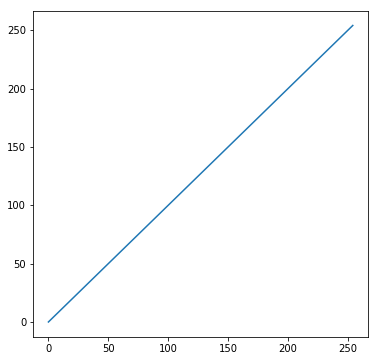
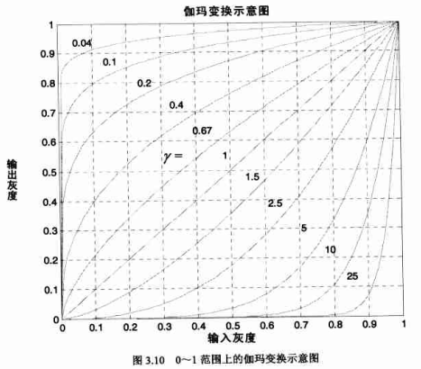
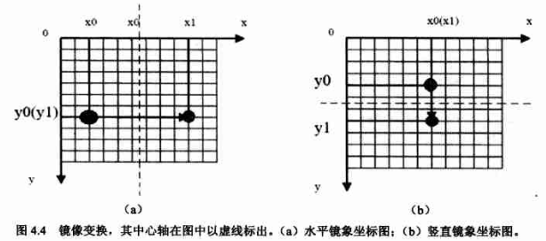
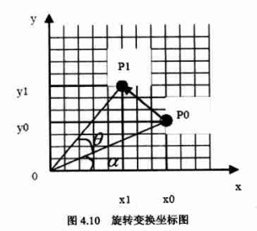
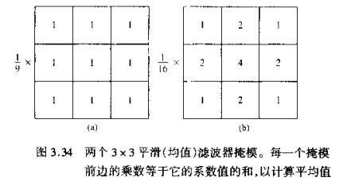
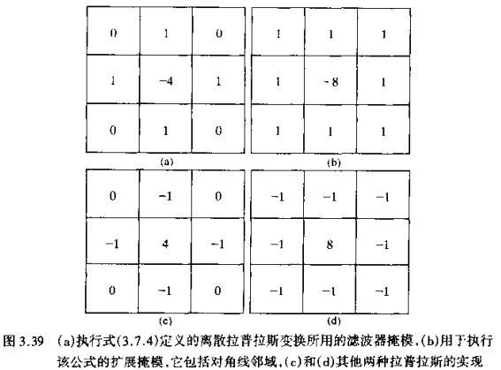
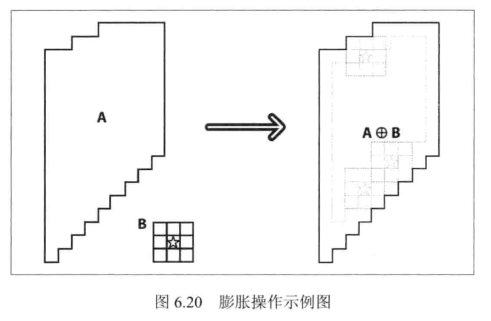
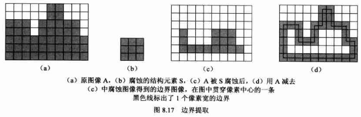

##                                 图像处理算法的理论与实践

### 1. 图像的点运算

点运算指的是对图像中的每个像素依次进行同样的灰度变换运算，通常用于改变图像的灰度范围及分布。设$r$和$s$分别是输入图像$f(x,y)$和输出图像$g(x,y)$在任一点的灰度值，则点运算可以使用下面的公式定义：
$$
S=T(r)
$$
其中，$T$为采用的点运算算子，表示在原始图像和输出图像之间的某种灰度级映射关系。

#### 1.1 灰度线性变换

灰度线性变换函数$f(x,y)$是一个一维线性函数：
$$
D_{B}=f(D_{A})=kD_{A}+b
$$
其中参数$k$为线性函数的斜率，$b$为线性函数在$y$轴的截距，$D_{A}$表示输入图像的灰度，$D_{B}$表示输出图像的灰度。当斜率大于1时，输出图像的对比度将增大；反之减小。特殊情况下，当$k=-1, b = 255$时，输出图像的灰度正好反转，这种反转处理适用于增强暗色图像中亮度较大的细节部分。



OpenCV示例程序如下：

```C++
#include <opencv2/opencv.hpp>
using namespace cv;
int main()
{
	Mat srcImage = imread("opencv_test.jpg");
	Mat grayImage;
	cvtColor(srcImage, grayImage, CV_BGR2GRAY);
	Mat dstImage = 0.6*grayImage - 5;

	imshow("before", grayImage);
	imshow("after", dstImage);
	waitKey();
}
```

#### 1.2 灰度对数变换

对数变换的一般表达式为：
$$
d=c*log(1+s)
$$
其中，$c$为尺度比例常数，$s$为源灰度值，$d$为变换后的目标灰度值。

由对数函数曲线可知，对数变换可以增强图像中较暗部分的细节，从而可以用来扩展被压缩的高值图像中的较暗元素，因此对数变换被广泛用于频谱图像的显示中。


OpenCV代码示例如下：

```C++
#include <opencv2/opencv.hpp>
using namespace cv;
int main()
{
	Mat srcImage = imread("test.jpg");
	Mat dstImage(srcImage.size(), CV_32FC3);
	float pixels[256];
	for (int i = 0; i < 256; i++)	pixels[i] = log(1 + i);

	for (int x=0; x<srcImage.rows; x++)
	{
		for (int y=0; y<srcImage.cols; y++)
		{
			dstImage.at<Vec3f>(x, y)[0] = pixels[srcImage.at<Vec3b>(x, y)[0]];
			dstImage.at<Vec3f>(x, y)[1] = pixels[srcImage.at<Vec3b>(x, y)[1]];
			dstImage.at<Vec3f>(x, y)[2] = pixels[srcImage.at<Vec3b>(x, y)[2]];
		}
	}
	normalize(dstImage, dstImage, 0, 255, CV_MINMAX);
	imshow("before", srcImage);
	imshow("after", dstImage);
	waitKey();
}
```

#### 1.3 指数变换

指数变换是另一种常用的灰度非线性变换，其表达式为：
$$
y=(x+exp)^b
$$
其中，$x$与$y$的取值范围均为$[0,1]$，$exp$为补偿洗漱，$b$则为伽马系数。伽马系数取值决定了输入图像和输出图像之间的灰度映射方式，即决定是增强低灰度还是增强高灰度。



OpenCV代码示例：

```C++
#include <opencv2/opencv.hpp>
using namespace cv;
int main()
{
	Mat srcImage = imread("test.jpg");
	Mat grayImage;
	cvtColor(srcImage, grayImage, CV_BGR2GRAY);
	Mat dstImage(grayImage.size(), grayImage.type());

	float pixels[256];
	for (int i = 0; i < 256; i++)	pixels[i] = sqrt(float(i)/255) * 255;

	auto iter = grayImage.begin<uchar>();
	auto iter_dst = dstImage.begin<uchar>();
	while (iter != grayImage.end<uchar>())
	{
		*iter_dst = pixels[*iter];
		iter++; iter_dst++;
	}

	imshow("before", srcImage);
	imshow("after", dstImage);
	waitKey();
}
```

#### 1.4 灰度阈值变换

灰度阈值变换可以将灰度图像装换成黑白的二值图像。用户指定一个灰度值作为阈值，如果图像中像素的灰度值小于该阈值，则将该像素灰度值设为0；否则设为1。其表达式为：
$$
f(x)=\left\{\begin{matrix}
0, x<T\\ 
255, x\geq T
\end{matrix}\right.
$$
OpenCV代码示例：

```C++
#include <opencv2/opencv.hpp>
using namespace cv;
int main()
{
	Mat srcImage = imread("test.jpg");
	Mat grayImage;
	cvtColor(srcImage, grayImage, CV_BGR2GRAY);
	Mat dstImage(grayImage.size(), grayImage.type());

	auto iter = grayImage.begin<uchar>();
	auto iter_dst = dstImage.begin<uchar>();
	while (iter != grayImage.end<uchar>())
	{
		*iter_dst = (*iter) < 100 ? 0 : 255;  //阈值处理
		iter++; iter_dst++;
	}

	imshow("before", grayImage);
	imshow("after", dstImage);
	waitKey();
}
```

#### 1.5 直方图均衡化

灰度直方图描述了一幅图像的灰度级统计信息，表示图像中各个灰度级出现的次数或概率。主要应用于图像分割和图像灰度变换处理中。

直方图均衡是指通过某种灰度映射使输入图像转换为在每一灰度级上都有近似相同的像素点数的输入图像。在经过均衡化处理后的图像中，像素将占有尽可能多的灰度级并且均匀分布。因此，均衡化之后的图像具有较高的对比度和动态范围。

为便于分析，我们首先考虑灰度范围为$[0,1]$且连续的情况，此时图像的归一化直方图为概率密度函数：
$$
p(x), 0\leq x\leq 1
$$
由概率密度函数的性质，有：
$$
\begin{matrix}
{\int_{x=0}^{1}p(x)} = 1
\end{matrix}
$$
设转换前的概率密度函数为$p_r(r)$，转换后图像的概率密度函数为$p_s(s)$，转换函数（灰度映射关系）为$s=f(r)$。则有：
$$
p_s(s) = p_r(r) \cdot \frac{\mathrm{d} r}{\mathrm{d} s}
$$
如果转换后图像的直方图是均匀分布的，那么其概率密度函数$p_s(s)=1$，则上式可以转化为：
$$
p_r(r) = \frac{\mathrm{d} s}{\mathrm{d} r}
$$
等式两边对$r$积分，可得：
$$
s=\int_{u=0}^{r}p_{r}(u)du
$$
上式被称为图像的累积分布函数，将其映射到$[0,255]$，并进行离散化，得到转换公式：
$$
D_B = f(D_A)=\frac{255}{A_0}\cdot \sum_{i=0}^{D_A}H_i
$$
其中，$D_B$为转换后的灰度值，$D_A$为转换前的灰度值，$H_i$为第$i$级灰度的像素个数，$A_0$为图像像素总数。

OpenCV代码示例如下：

```C++
#include <opencv2/opencv.hpp>
using namespace cv;

int main()
{
	Mat srcImage = imread("test.jpg");
	cvtColor(srcImage, srcImage, CV_BGR2GRAY);
	Mat dstImage;
	equalizeHist(srcImage, dstImage);   //均衡化函数
	imshow("before", srcImage);
	imshow("after", dstImage);
	waitKey();
}
```


### 2. 图像的几何变换 

图像几何变换（或空间变换），是将图像中的坐标位置映射到另一幅图像中的新坐标位置。其不改变图像的像素值，只是将图像平面上进行像素的重新排列。常见的几何变换有平移、旋转和镜像。由于图像像素可能会被映射到非整数坐标上，所以有事需要使用灰度差值算法进行处理。

#### 2.1 图像平移

图像平移就是将图像中所有点按照指定的平移量进行移动，平移公式如下：
$$
\left\{\begin{matrix}
x_1 = x_0 + T_x\\ 
y_1 = y_0 + T_y
\end{matrix}\right.
$$
其中，$(x_1, y_1)$为平移后的点坐标，$(x_), y_0$为原图像坐标，$(T_x, T_y)$为平移量。

对于平移后像素点对应的元图像像素点，超出了原图像范围的，可以直接将它的像素值同意设为0或255。对于原图像中被移出图像显示区域的像素点，通常有两种处理方法：直接丢弃或者增加目标图像的尺寸。

OpenCV代码示例如下：

```C++
#include <opencv2/opencv.hpp>
using namespace cv;
int main()
{
	Mat srcImage = imread("test.jpg");
	cvtColor(srcImage, srcImage, CV_BGR2GRAY);
	Mat dstImage = Mat::zeros(srcImage.size(), srcImage.type());
	
	int trans[] = { 20,50 };  //平移量
	for (int i = 0; i < srcImage.rows; i++)
	{
		for (int j=0; j<srcImage.cols; j++)
		{
			int dx = i + trans[0];
			int dy = j + trans[1];
			if (dx >=0 && dy >= 0 && dx < dstImage.rows && dy <dstImage.cols)
			{
				dstImage.ptr(dx)[dy] = srcImage.ptr(i)[j];
			}
		}
	}

	imshow("before", srcImage);
	imshow("after", dstImage);
	waitKey();
}
```

#### 2.2 图像镜像

镜像变换分为水平镜像和竖直镜像。水平镜像即将图像左半部分和右半部分以图像竖直中轴线为中心轴进行兑换；而竖直镜像则是将图像上半部分和上半部分以图像水平中轴线为中心轴进行兑换。



变换公式如下：

1）水平镜像
$$
\left\{\begin{matrix}
x_1 = Width - x_0 \\ 
y_1 =  y_0 
\end{matrix}\right.
$$
1）竖直镜像
$$
\left\{\begin{matrix}
x_1 = x_0 \\ 
y_1 = Height -  y_0 
\end{matrix}\right.
$$
其中，$Width$为图像宽度，$Height$为图像高度。

OpenCV代码实现如下：

```C++
#include "stdafx.h"
#include <opencv2/opencv.hpp>
using namespace cv;

int main()
{
	Mat srcImage = imread("test.jpg");
	cvtColor(srcImage, srcImage, CV_BGR2GRAY);
	Mat dstImage = Mat::zeros(srcImage.size(), srcImage.type());
	
	
	for (int i = 0; i < srcImage.rows; i++)
	{
		for (int j=0; j<srcImage.cols; j++)
		{
			dstImage.ptr(i)[srcImage.cols - j] = srcImage.ptr(i)[j];  //水平镜像
		}
	}

	imshow("before", srcImage);
	imshow("after", dstImage);
	waitKey();
}
```

#### 2.3 图像缩放

图像缩放是指图像按照指定的比率放大或缩小。假设图像x轴方向的缩放比率$S_x$，y轴方向的缩放比率$S_y$，相应的变换表达式为：
$$
\left\{\begin{matrix}
x_1 = x_0 \cdot S_x \\ 
y_1 = y_0 \cdot S_y
\end{matrix}\right.
$$
要求缩放后图像对应的源图像像素坐标，根据上式的逆运算即可。

直接根据缩放公式计算得到的目标图像，某些映射源坐标可能不是整数，从而找不到对象的像素位置。例如，当$S_x=S_y=2$时，图像放大2被，放大图像中的像素$(1,1)$对应于源图像中的像素$(0.5, 0.5)$，由于不是整数坐标，自然无法直接提取该坐标的灰度值。通常的处理办法是通过插值来取其近似值，常用的如：最近邻插值和双线性插值等。

OpenCV代码实现如下：

```C++
#include <opencv2/opencv.hpp>
#include <math.h>
using namespace cv;

int main()
{
	Mat srcImage = imread("test.jpg");
	cvtColor(srcImage, srcImage, CV_BGR2GRAY);
	double s = 0.8;  //缩放比例0.8
	Mat dstImage(ceil(srcImage.rows * s), ceil(srcImage.cols * s), srcImage.type());
	
	for (int i = 0; i < dstImage.rows; i++)
	{
		for (int j=0; j<dstImage.cols; j++)
		{
			int srcRow = lround(i / s);
			int srcCol = lround(j / s);
			dstImage.ptr(i)[j] = srcImage.ptr(srcRow)[srcCol];  //最近邻插值
		}
	}

	imshow("before", srcImage);
	imshow("after", dstImage);
	waitKey();
}
```

#### 2.4 图像旋转

图像旋转一般是指将图像围绕某一指定方向旋转一定的角度。旋转通常会改变图像的大小，也需要向平移操作一样对图像进行截取或者扩展。

首先我们来看以原点为中心的图像旋转。假设点$P(x_0, y_0)$绕原点逆时针旋转角度$\theta $到点$P_1(x_1, y_1)$，则两点的变换关系有：
$$
\left\{\begin{matrix}
x_1 = x_0 \cdot cos\theta - y_0 \cdot cos\theta \\ 
y_1 = y_0 \cdot cos\theta + x_0 \cdot cos\theta
\end{matrix}\right.
$$


转换为矩阵变换（便于后面任意点旋转推导）为：

$$
\begin{bmatrix}
x_1\\ 
y_1\\ 
1
\end{bmatrix}=\begin{bmatrix}
cos \theta & -sin \theta  & 0\\ 
sin \theta & cos \theta & 0\\ 
0 & 0 & 1
\end{bmatrix}\begin{bmatrix}
x_0\\ 
y_0\\ 
1
\end{bmatrix}
$$
以图像中心$(0.5w, 0.5h)$进行旋转来演示任意点旋转的过程。我们可以将任意点旋转分解为坐标轴平移和绕原点旋转两种操作。这一过程可以归纳为：1）将坐标系I变为II；2）将该点顺时针选在$\theta$；将坐标系II还原为I。


OpenCV代码示例如下：

```C++
#include <opencv2/opencv.hpp>
using namespace cv;

int main()
{
	Mat srcImage = imread("test.jpg");
	cvtColor(srcImage, srcImage, CV_BGR2GRAY);
	Mat dstImage;
	rotate(srcImage, dstImage, ROTATE_90_CLOCKWISE);  //绕图像中心顺时针旋转90度

	imshow("before", srcImage);
	imshow("after", dstImage);
	waitKey();
}
```

#### 2.5 插值算法

前面已经使用过了最近邻插值，即将输出像素值映射为最近的采样点像素值。其计算简单，但是结果有时并不理想。
$$
f(x,y) = g(round(x), round(y))
$$
双线性插值：
$$
\left\{\begin{matrix}
f(x, floor(y)) = (x - floor(x))\cdot f(floor(x),floor(y)) + (ceil(x) - x)\cdot f(ceil(x),floor(y))\\ 
f(x, ceil(y)) = (x - floor(x))\cdot f(floor(x),ceil(y)) + (ceil(x) - x)\cdot f(ceil(x),ceil(y))\\ 
f(x, y) = (y - floor(y))\cdot f(x, floor(y)) + (ceil(y) - y)\cdot f(x, ceil(y))
\end{matrix}\right.
$$
双线性插值的假设是在原图的灰度在两个像素之间是线性变化的。一般情况下，双线性插值都能取得不错的效果。


### 3. 空间域图像增强

图像增强是指根据特定的需要突出一幅图像中的某些信息，同事削弱或去除某些不需要的信息的处理方法。其目的是为了改善图像质量，便于人的观察或机器识别。

空间增强技术可以分为两大类：空间域增强和频率域增强。空间曾庆是基于图像中每一个邻域内的像素点进行灰度变换运算，某个点变换后的灰度由该点邻域之内的那些点的灰度值共同决定。空间域增强技术主要包括直方图修正、灰度变换增强、图像平滑化以及图像锐化等。在增强过程中可以财通单一方法处理，但更多实际情况是需要采用几种方法联合处理，才能达到预期的增强效果。

#### 3.1 均值滤波

均值滤波是用模板确定的邻域内像素的平均灰度值取代替图像每个像素点的值，这种处理减小了图像灰度的尖锐变化。由于典型的随机噪声由灰度级的尖锐组成，因此常见的平滑处理应用就是减噪。然而，图像变换也是由图像灰度尖锐变化带来的特性，所以均值滤波处理还是存在不希望的边缘模糊的负面效应。因此，均值滤波的主要应用是去除图像中的不相干细节，其中不相干是指与滤波模板尺寸先比，较小的像素区域。

下图显示了两个$3\times 3$均值滤波器。第一个滤波器产生模板下标准的像素平均值。第二种模板更为重要一些，也称为加权平均，一般我们认为处于模板中心位置的像素比其他任何像素的权值都要大，而距离模板中心较远的其他像素就显得不太重要。

第二种加权平均的均值滤波方法，通常也称为高斯滤波，因为其选择权值的方法是根据高斯函数的形状选取的。高斯滤波对于抑制服从正态分布的噪声非常有效。



需要注意的是，当模板位于图像边缘时，模板的某些元素很可能位于图像之外，这时需要对边缘附近的像素特殊处理，以避免引用到本不属于图像的无意义的值。通常解决边界问题的策略有：1）收缩处理范围，忽略边界点；2）使用常数填充图像后，再对进行滤波操作；3）复制原图像的像素填充图像，即不对边界点进行滤波操作，而是直接复制到目标图像上。

OpenCV代码示例：

```C++
#include <opencv2/opencv.hpp>
#include <math.h>
using namespace cv;

int main()
{
	Mat srcImage = imread("test.jpg");
	cvtColor(srcImage, srcImage, CV_BGR2GRAY);
	Mat dstImage(srcImage.size(), srcImage.type());
	
	for (int i = 0; i < dstImage.rows; i++)
	{
		for (int j=0; j<dstImage.cols; j++)
		{
			if (i!=0 && i!=dstImage.rows-1 && j!=0 && j!= dstImage.cols-1)
			{
				dstImage.ptr(i)[j] = (srcImage.ptr(i - 1)[j - 1] + srcImage.ptr(i)[j - 1] + srcImage.ptr(i + 1)[j - 1]
					+ srcImage.ptr(i - 1)[j] + srcImage.ptr(i)[j] + srcImage.ptr(i + 1)[j]
					+ srcImage.ptr(i - 1)[j + 1] + srcImage.ptr(i + 1)[j + 1] + srcImage.ptr(i + 1)[j + 1]) / 9;
			}
			else
			{
				dstImage.ptr(i)[j] = srcImage.ptr(i)[j];
			}
		}
	}

	imshow("before", srcImage);
	imshow("after", dstImage);
	waitKey();
}
```

OpenCV中有均值滤波的API，可以直接使用：

```C++
// 均值滤波
void blur( InputArray src, OutputArray dst, Size ksize, Point anchor = Point(-1,-1), int borderType = BORDER_DEFAULT );
// 高斯滤波
void GaussianBlur( InputArray src, OutputArray dst, Size ksize, double sigmaX, double sigmaY = 0, int borderType = BORDER_DEFAULT );
```

其中，我们主要关系参数`Size`，其表示滤波模板的尺寸，也称为内核大小。`sigmaX`表示高斯核函数在X方向的标准偏差，`SigmaY`表示高斯核函数在Y方向的标准偏差。附上二维高斯函数：
$$
G(x,y) = Ae^{\frac{-(x-u_x)^2}{2{\sigma _x}^2} + \frac{-(y-u_y)^2}{2{\sigma _y}^2}}
$$

#### 3.2 中值滤波

中值滤波是一种典型的非线性滤波技术，其基本思想是用像素点邻域灰度值的中值来代替该像素点的灰度值。该方法在去除脉冲噪声、椒盐噪声的同时，又能保留图像的边缘细节。

OpenCV中有中值滤波的API，可以直接使用：

```C++
void medianBlur( InputArray src, OutputArray dst, int ksize );
```

其中`ksize`是孔径的线性尺寸，注意这个参数必须是大于1的奇数。

中值滤波效果依赖于滤波窗口的大小，太大会使边缘模糊，太小则去躁效果不佳。因为噪声点和边缘点同样是灰度变化较为剧烈的像素，普通中值滤波在改变噪声点灰度的同时，会一定程度的改变边缘像素灰度值。但是噪声点几乎都是邻域像素的极值，而边缘往往不是，因此可以利用这个特性来限制中值滤波。

具体改进方法如下：逐行扫描图像，每处理一个像素时，判断该像素是否是滤波窗口覆盖下邻域像素的极大或极小值。如果是，则采用正常的中值滤波处理该像素；如果不是，则不予处理。在实践中，这个方法能够有效地去除椒盐噪声，且几乎不影响边缘。

#### 3.3 图像锐化

图像锐化的目的是使模糊的图像变得更加清晰，主要用于增强图像的灰度跳变部分，这一点与图像平滑正好相反。从数学的角度上来讲，线性平滑都是基于图像邻域的加权求和或积分运算；而锐化则通过其逆运算导数或有限查分来实现。

为便于数值计算，微分通常使用差分来表示，一阶微分和二阶微分的差分表示如下：
$$
\begin{matrix}
\frac{\partial f}{\partial x} = f(x+1) - f(x)\\ 
\frac{\partial^2 f}{\partial x^2} = f(x+1) + f(x-1) - 2f(x)
\end{matrix}
$$
对于图像增强来说，通常二阶微分处理比一阶微分好一些，因为二阶微分对细节有较强的响应，并且对灰度级阶梯变化产生双响应，增强细节的能力更好。

二元图像的拉普拉斯算子：
$$
\begin{matrix}
\bigtriangledown ^2f = \frac{\partial^2 f}{\partial x^2} + \frac{\partial^2 f}{\partial y^2}\\ 
=f(x+1,y) + f(x-1,y) + f(x,y+1) + f(x,y-1) - 4f(x,y)
\end{matrix}
$$
这个公式可以用下图所示的模板来实现，它们给出了以90度旋转的各向同性的结果，以及45度增幅之后的模板。



由于拉普拉斯微分算子强调图像中灰度的突变及降低灰度慢变化的区域，这将产生一幅把图像中的浅灰色边线和突变点叠加到暗背景中的图像。将原始图像和拉普拉斯图像叠加在一起的简单方法可以保护拉普拉斯锐化处理的效果，同时又能复原背景信息。
$$
g(x,y) = f(x,y) +\bigtriangledown ^2f(x,y)
$$

```C++
#include <opencv2/opencv.hpp>
#include <math.h>
using namespace cv;

int main()
{
	Mat srcImage = imread("opencv_test.jpg");
	cvtColor(srcImage, srcImage, CV_BGR2GRAY);
	Mat dstImage(srcImage.size(), srcImage.type());
	
	for (int i = 0; i < dstImage.rows; i++)
	{
		for (int j = 0; j < dstImage.cols; j++)
		{
			if (i != 0 && i != dstImage.rows - 1 && j != 0 && j != dstImage.cols - 1)
			{
				dstImage.ptr(i)[j] = -1*(srcImage.ptr(i - 1)[j - 1] + srcImage.ptr(i)[j - 1] + srcImage.ptr(i + 1)[j - 1]
					+ srcImage.ptr(i - 1)[j] + srcImage.ptr(i + 1)[j] + srcImage.ptr(i - 1)[j + 1]
					+ srcImage.ptr(i)[j + 1] + srcImage.ptr(i + 1)[j + 1] - 9*srcImage.ptr(i)[j]);
			}
			else
			{
				dstImage.ptr(i)[j] = srcImage.ptr(i)[j];
			}
		}
	}

	imshow("before", srcImage);
	imshow("after", dstImage);
	waitKey();
}
```

### 4. 频率域图像增强


### 5. 形态学图像处理

形态学是一门建立在格论和拓扑学基础上的图像分析学科，其基本的运算包括：二值腐蚀和膨胀、二值开闭运算、骨架抽取击中击不中变换、顶帽变换等。

最基本的形态学操作有两种，分别是膨胀与腐蚀。膨胀与腐蚀能实现多样功能：消除噪声；分割出独立的图像元素，在图像中链接相邻的元素；寻找图像中的冥想的极大值区域或极小值区域；求出图像的梯度。

#### 5.1 膨胀与腐蚀

从数学角度来说，膨胀或腐蚀操作就是将图像与核进行卷积。核可以是任何形状核大小，它拥有一个单独定义出来的参考点，称之为锚点。多数情况下，核是一个晓得，中间带有参考点的实心正方形或圆盘。

膨胀就是求局部最大值的操作。核B与图像做卷积，即计算核B覆盖的区域的像素点的最大值，并把这个最大值赋给参考点指定的像素。这样就会使图像中的高亮区域逐渐增长。



腐蚀与膨胀是相反的一对操作，即腐蚀就是求局部最小值的操作。

OpenCV代码示例：

```C++
#include <opencv2/opencv.hpp>
using namespace cv;
int main()
{
	Mat srcImage = imread("opencv_test.jpg");
	cvtColor(srcImage, srcImage, CV_BGR2GRAY);

	Mat erodeImage;
	Mat element = getStructuringElement(MORPH_RECT, Size(5, 5));
	erode(srcImage, erodeImage, element);

	Mat dilateImage;
	dilate(srcImage, dilateImage, element);

	imshow("origin", srcImage);
	imshow("erode", erodeImage);
	imshow("dilate", dilateImage);
	waitKey();
}
```

#### 5.2 开运算、闭运算、形态学梯度、顶帽、黑帽

开、闭运算是腐蚀和膨胀组合使用的结果。开运算就是先腐蚀后膨胀，闭运算则是先膨胀后腐蚀。开运算可以用来消除小物体，在纤细点处分离物体，并且在平滑较大物体的边界的同时不明显改变其面积。闭运算则能够排除小型黑色区域。

形态学梯度是膨胀图与腐蚀图之差。对二值图像进行这一操作，可以将团块的边缘突出出来，用于保留物体的边缘轮廓。

顶帽运算为原图像与开运算的结果图之差，其作用是放大裂缝或者局部低亮度的区域；往往用来分离比临近点亮的斑块。黑帽运算则是闭运算的结果图与原图像之差，其作用是突出比原图轮廓周围的区域更暗的区域；用于分离比临近点暗一些的斑块，效果图有着非常完美的轮廓。

OpenCV相关API：

```C++
// 参数op表示形态学运算的类型，MORPH_OPEN表示开运算，MORPH_CLOSE表示闭运算，
//   MORPH_GRADIENT表示形态学梯度，MORPH_TOPHAT表示顶帽，MORPH_BLACKHAT表示黑帽，
//   MORPH_ERODE表示腐蚀，MORPT_DILATE表示膨胀。
// 参数kernel表示形态学运算的内核。若为NULL则表示使用的参考点位于中心的3*3的核，
//   一般使用函数getStructuringElement指定形状核尺寸获取相应的结构元素，
//   内核形状有MORPH_RECT矩形，MORPH_CROSS十字形，MORPH_ELLIPSE椭圆形
// 参数iterations为迭代使用函数的次数，默认为1
void morphologyEx( InputArray src, OutputArray dst,
                  int op, InputArray kernel,
                  Point anchor = Point(-1,-1), int iterations = 1,
                  int borderType = BORDER_CONSTANT,
                  const Scalar& borderValue = morphologyDefaultBorderValue() );
```

#### 5.3 轮廓提取

以二值图像为例，要提取物体的轮廓，容易想到的办法就是将所有物体内部的点删除（置为背景色）。具体的说，可以逐行扫描图像，如果发现一个黑点的8个邻域都是黑点，则该点为内部点，在目标图像中将其删除。实际上着相当与使用3*3的结构元素对原图像进行腐蚀，在用原图像减去腐蚀后的图像。这样敲好删除了这些内部点，流向了边界元素。



OPenCV代码示例如下：

```C++
#include <opencv2/opencv.hpp>
using namespace cv;

int main()
{
	Mat srcImage = imread("test2.jpg");
	cvtColor(srcImage, srcImage, CV_BGR2GRAY);

	Mat erodeImage;
	Mat element = getStructuringElement(MORPH_RECT, Size(3, 3));
	erode(srcImage, erodeImage, element);

	Mat dstImage = srcImage - erodeImage;
	imshow("origin", srcImage);
	imshow("after", dstImage);
	waitKey();
}
```

#### 5.4 区域填充


```C++
#include<opencv2\opencv.hpp>
using namespace cv;

/***************************************************
功能：以ptStart为起点对图像进行填充
参数：src-边界图像
ptStart-种子点的坐标
****************************************************/
void BoundarySeedFill(Mat &src, Mat &dst, Point ptStart)
{
	Mat element = getStructuringElement(MORPH_CROSS, Size(3, 3));
	Mat tempImg = Mat::ones(src.size(), src.type()) * 255;
	Mat revImg = tempImg - src;//原图像的补集
	dst.at<uchar>(ptStart.y, ptStart.x) = 255;//绘制种子点
	while (true)//循环膨胀图像直到图像不在产生变化
	{
		Mat temp;
		dst.copyTo(temp);
		dilate(dst, dst, element); //用十字结构元素膨胀
		dst = dst & revImg; //限制膨胀不会超过原始边界
		if (countNonZero(dst - temp) == 0) //不在变化时停止
		{
			break;
		}
	}
}

int main()
{
	Mat src = imread("binaryImg.jpg");
	cvtColor(src, src, COLOR_BGR2GRAY);  //转为灰度图
	threshold(src, src, 128, 255, THRESH_BINARY);  //二值化
	imshow("原始图像", src);

	//区域填充
	Mat dst = Mat::zeros(src.size(), src.type());
	BoundarySeedFill(src, dst, Point(src.rows/2, src.cols/2));
	imshow("边界图像", dst);
	waitKey(0);
}
```

