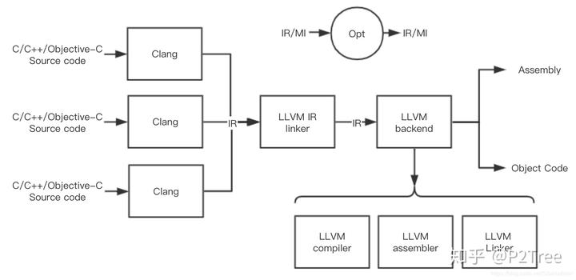

# LLVM基础概念

LLVM是一个编译器框架，你可以基于LLVM提供的功能开发自己的模块，并集成在LLVM系统上，增加它的功能，或者就单纯自己开发软件工具，而利用LLVM来支撑底层实现。LLVM由一些库和工具组成，正因为它的这种设计思想，使它可以很容易和IDE集成（因为IDE软件可以直接调用库来实现一些如静态检查这些功能），也很容易构建生成各种功能的工具（因为新的工具只需要调用需要的库就行）。

