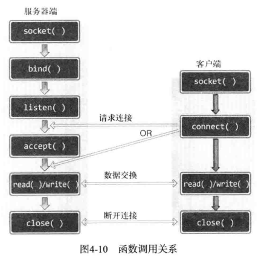
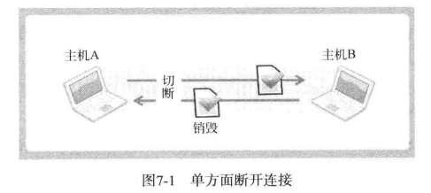
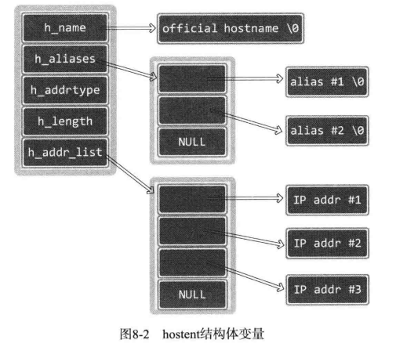
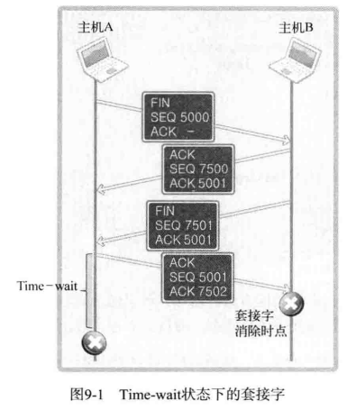

## Unix网络编程

### 1. 套接字编程基础

#### 1.1 套接字地址结构

IPv4套接字地址结构通常也称为“网际套接字地址结构”，它以sockaddr_in命名，定义在`<netinet/in.h>`头文件中。其POSIX定义如下：

```C++
typedef uint32_t in_addr_t;
typedef uint16_t in_port_t;
struct in_addr {
    in_addr_t s_aadr;  //32bit IPv4 address
};

struct sockaddr_in {                 /* in表示Internet */
    sa_family_t     sin_family;      /* 16bit, Internet地址族 */
    in_port_t       sin_port;        /* 16bit, 端口号 */
    struct in_addr  sin_addr;        /* Internet地址 */
    char            sin_zero[8];     /* 填充0（保持与struct sockaddr 一样大小） */
};
```

POSIX规范只需要s_addr、sin_family和sin_port这3个字段，其他不做要求。如sin_zero字段未曾使用，通常设置为0。

成员`sin_family`表示地址族，枚举定义有`AF_INET`，表示IPv4网络协议中使用的地址族；`AF_INET6`，表示IPv6中使用的地址族。

成员`sin_port`和`sin_addr`分别代表端口号和IP地址，均已网络字节序保存，赋值时需要进行字节序转换。

当作为一个参数传递进任何套接字函数时，套接字地址结构总是以指针或引用形式来传递。然而以这样的指针作为参数之一的任何套接字函数必须处理来自所支持的任何协议族的套接字地址结构。

在如何声明所传递指针的数据类型上存在一个问题。有了ANSI C后解决办法很简单：`void* `是通用的指针类型。然而套接字函数是在ANSI C之前定义的，在1982年采取的办法是在`<sys/socket.h>`头文件中定义一个通用的套接字地址结构sockaddr，如下所示：

```C++
struct sockaddr {
	sa_family_t sa_family;       /* 地址族, AF_xxx */
	char sa_data[14];            /* 14字节的协议地址 */
}
```

于是套接字函数定义为以指向某个通用套接字地址结构的一个指针作为其参数之一，这正如bind函数的ANSI C函数原型所示：

```C++
int bind(int, struct sockaddr *, socklen_t);
```

这就要求对这些函数的任何调用都必须要将指向特定于协议的套接字地址结构的指针进行类型强制转换，变成指向某个通用套接字地址结构的指针。下边例子展示了这个过程：

```C++
// 1. 定义一个sockaddr_in结构变量，并将它初始化为0
struct sockaddr_in myad;
memset(&myad, 0, sizeof(myad));

// 2. 给这个结构变量赋值
myad.sin_family = AF_INET;
myad.sin_port = htons(8080);
myad.sin_addr.s_addr = htonl(INADDR_ANY);

// 3. 在进行函数调用时，将这个结构强制转换为struct sockaddr类型
bind(serverFd, (struct sockaddr *) &myad, sizeof(myad));
```

从程序开发人员的观点看，通用套接字地址结构的**唯一用途**就是对指向特定与协议的套接字地址结构的指针执行类型强制转换。

#### 1.2 IP地址转换函数

IP地址转换函数是指完成点分十进制IP地址与二进制IP地址之间的相互转换。IP地址转换主要由inet_addr、inet_aton和inet_ntoa这3个函数完成，但这三个函数都只能处理IPv4地址而不能处理IPv6地址。新的函数inet_pton跟inet_ntop则同时处理IPv4和IPv6。

```C++
#include <sys/types.h>
#include <sys/socket.h>
#include <arpa/inet.h>
// 这个函数转换字符串到网络地址，第一个参数af是地址族，转换后存在dst中
// 若成功则返回1；若输入不是有效的表达式则返回0；若出错则返回-1。
// src为指向字符型的地址，即ASCII的地址的首地址（ddd.ddd.ddd.ddd格式的）
// 函数将该地址转换为in_addr的结构体，并复制在*dst中
// af : AF_INET为IPv4， AF_INET6为IPv6
int inet_pton(int af, const char *src, void *dst);

// 这个函数转换网络二进制结构到ASCII类型的地址，参数的作用和上面相同，只是多了一个参数socklen_t cnt,
// 它是所指向缓存区dst的大小，避免溢出，如果缓存区太小无法存储地址的值，则返回一个空指针，并将errno置为ENOSPC。
// 若成功则返回指向结果的指针，若出错则返回NULL。
const char *inet_ntop(int af, const void *src, char *dst, socklen_t cnt);

//将点分格式的字符串转换为32位大端序整型，失败时返回INADDR_NONE
in_addr_t inet_addr(const char* str);
//作用同inet_addr，仅入参的差异，将结果保存在in_addr结构体变量中
//成功时返回1，失败时返回0
int inet_aton(const char* str, in_addr* addr);
//将整型IP地址转换为点分字符串格式并返回
//函数将字符串保存在内存空间中，调用函数后，因立即复制到自己申请的内存中，
//避免下次调用函数时，数据被覆盖
char* inet_ntoa(in_addr addr);
```

使用示例：

```C++
const char* addr = "1.2.3.4";
unsinged long conv_addr = inet_addr(addr);
if(conv_addr != INADDR_NONE)
    printf("Network orderd ineger addr: %#lx\n", conv_addr);  //0x4030201

// 转换后的IP地址信息需要保存到sockaddr_in的in_addr变量中采用意义，
// 因此，inet_aton函数比inet_addr函数更加常用
sockaddr_in addr_inet;
inet(addr, &addr_inet.sin_addr);

char str_addr[20];
char* str_ptr = inet_ntoa(addr_inet.sin_addr);
strcpy(str_addr, str_ptr);
printf("Dotted-Decimal notation: %s\n", str_addr);

const char* addr2 = "127.0.0.1";
char str_addr2[20];
sockaddr_in s;
inet_pton(AF_INET, addr2, (void*)&s);
printf("Network orderd ineger addr: %x\n", s.sin_addr.s_addr);
inet_ntop(AF_INET, (void*)&s, str_addr2, 16);
printf("Dotted-Decimal notation: %s\n", str_addr2);
```

#### 1.3 字节序转换函数

CPU向内存保存数据有两种方式：大端序和小端序。大端序即高位字节存放在地位地址，小端序即高位字节存放在高位地址。

网络传输数据时约定统一采用大端序，这种约定称为网络字节序。而主机的字节序则随平台不同存在差异，通常我们会使用字节序转换函数来消除差异。

```C++
#include <net/in.h>
//h代表主机host, n代表网络network
//s代表2字节无符整形short, 可用于端口号转换
//l代表4字节无符整形long, 可用于IP地址转换
unsigned short htons(unsigned short);
unsigned short ntohs(unsigned short);
unsigned long htonl(unsigned long);
unsigned long htohl(unsigned long);
```


### 2. 基本TCP套接字编程

```C++
#include <sys/socket.h>

// 用于创建套接字
// family 指明协议族, AF_INET, AF_INET6
// type 指明套接字类型, SOCK_STREAM字节流套接字, SOCK_DGAM数据报套接字
// protocol 一般无需指明, 设为0即可
int socket(int family, int type, int protocol);

// sock 希望进入等待连接请求状态的套接字
// backlog 连接请求等待队列的长度，表示最多使backlog个连接请求进入队列
int listen(int sock, int backlog);

// sock 服务器套接字的文件描述符
// addr 保存发起连接请求的客户端地址信息的变量地址值，调用函数后向传递来的地址变量参数填充客户端地址信息
// addrlen 第二个参数addr结构体的长度
int accept(int sock, sockaddr* addr, socklen_t* addrlen);

// sock 客户端套接字文件描述符
// servaddr 保存目标服务器端地址信息的变量地址值
// addrlen 以字节为单位传递已传递给第二个结构体参数的地址变量长度
int connect(int sock, sockaddr* servaddr, socklen_t addrlen);
```

TCP服务器端默认的函数调用顺序如下：

1. 创建套接字socket();
2. 分配套接字地址bind();
3. 等待连接请求状态listen();
4. 允许连接accept();
5. 数据交换read()/write();
6. 断开连接close();

服务器处于等待连接请求状态是指，客户端请求连接时，受理连接前一直使请求处于等待状态。客户端连接请求本身也是从网络中接收到的一种数据，而想要接收就需要套接字。此任务就由服务器端套接字完成。当客户端发起连接请求时，服务器端套接字就会受理连接请求，并将其加入连接请求等待队列。因此，只有在服务器调用listen函数后，客户端才能调用connect函数来发起连接请求。

accept函数用于受理连接请求等待队列中待处理的客户端连接请求。函数调用成功时，accept函数内部将产生用于数据IO的套接字，并返回其文件描述符。需要强调的是，套接字是自动创建的，并自动与发起连接请求的客户端建立连接。


基于TCP的服务器端/客户端函数调用关系




总体流程整理如下：服务器端创建套接字后连续调用bind、listen函数进入等待状态，客户端通过调用connect函数发起连接请求。需要注意的是，客户端智能等到服务端调用listen函数后才能调connect函数。同时要清楚，客户调用connect函数前，服务器端有可能率先调用accept函数。当然，此时服务器端调用accept函数时进入阻塞状态，直到客户端调用connect函数为止。

**其他IO函数**

```C++
#include<sys/socket.h>
// nbytes, 待传输的字节数
ssize_t send(int sockfd, const void* buf, size_t nbytes, int flags);
// nbytes, 可接收的最大字节数
ssize_t recv(int sockfd, const void* buf, size_t nbytes, int flags);

#include<sys/uio.h>
struct iovec{
    void* iov_base;  //缓冲地址
    size_t iov_len;  //缓冲大小
}
// writev函数可以将分散保存在多个缓冲区中的数据一并发送
ssize_t writev(int fd, const struct iovec* iov, int iovcnt);
// read函数可以由多个缓冲区接收数据
ssize_t readv(int fd, const struct iovec* iov, int iovcnt);

// flags可选项及含义
// MSG_OOB, 用于传输带外数据
// MSG_PEEK, 验证输入缓冲是否存在接收的数据
// MSG_DONTROUTE, 数据传输过程中不参照路由表，在本地网络中寻找目的地
// MSG_DONTWAIT, 调用IO函数时不阻塞，用于使用非阻塞IO
// MSG_WAITALL, 防止函数返回，直到接收全部请求的字节数
```

同时设置MSG_PEEK选项和MSG_DONTWAIT选项，以验证输入缓冲中是否存在接收的数据。设置MSG_PEEK选项并调用recv函数时，即使读取了输入缓冲的数据也不会删除。因此，该选项通常与MSG_DONTWAIT合作，用于调用以非阻塞方式验证带读取数据存在与否的函数。

如果需要传输的数据位于不同缓冲时，需要多次调用write函数；此时，一次writev函数调用就可以实现，可以通过减少系统调用的方式来提高效率。如果系统明确阻止了Nagle算法，那么通过writev函数减少数据包个数，也是可以极大提高效率的。

### 3. 优雅地断开套接字连接

Linux的close函数意味着完全断开连接，这不仅指无法传输数据，而且也不能接收数据。因此，在某些情况下，通信一方调用close函数断开连接就显得不太优雅。

主机A发送完最后的数据后，调用close函数断开连接，之后主机A无法再接收主机B传输的数据。实际上，是完全无法调用与接收数据相关的函数。最终，由主机B传输的、主机A必须接收的数据也销毁了。为了解决这类问题，只关闭一部分数据交换中使用的流（Half-close）的方法应运而生。断开一部分是指，可以传输数据但无法接收，或可以接收数据但无法传输，即关闭流的一半。



```C++
// howto = SHUT_RD, 断开输入流, 套接字无法接收数据, 即使输入缓冲收到数据也会抹去
// howto = SHUT_WR, 断开输出流, 套接字无法传输数据, 但输出缓冲中的未传输数据会传递至目标主机
// howto = SHUT_RDWR, 同时断开IO流
int shutdown(int sock, int howto);
```

### 4. 域名与IP地址转换

```C++
#include <netdb.h>

struct hostent
{
    char* h_name;    //官方域名
    char** h_aliases;//除官方以外的其他域名
    int h_addrtype;  //IP地址的地址族信息
    int h_length;    //IP地址的长度，IPv4长度为4；IPv6长度为16
    char** h_addr_list;//最重要的成员，此变量以整数形式保存域名对应的IP地址。
}

//成功是返回hostent结构体地址，失败时返回NULL指针
struct hostent* gethostbyname(const char* hostname);

//成功时返回hostent结构体变量地址值，失败时返回NULL
//addr, 含有IP地址信息的in_addr结构体指针, 为传递IPv4地址之外的其他信息, 该变量被申明为char*
//len, addr指针的字节数, IPv4时为4, IPv6时为16
//family, 传递的地址族信息
struct hostent* gethostbyaddr(const char* addr, socklent_t len, int family);
```

调用`gethostbyname`函数后返回的`hostent`结构体变量如图所示。`h_addr_list`变量可能保存着多个IP地址，因此变变量被声明为一个字符串指针数组。



### 5. 套接字的多种可选项

```C++
#include <sys/socket.h>
// 通过get/set接口来获取和设置套接字选项，成功返回1，失败返回-1
// sock, 套接字描述符
// level, 可选项的协议层
// optname, 可选项名
// optval, 可选项的值
// optlen, optval的字节数
int getsockopt(int sock, int level, int optname, void* optval, socklen_t* optlen);
int setsockopt(int sock, int level, int optname, const void* optval, socklen_t optlen);
```

SO_RCVBUF是输入缓冲大小相关的可选项，SO_SNDBUG是输出缓冲大小相关可选项。用这两个可选项既可以读取当前IO缓冲大小，也可以进行更改。缓冲大小的设置并不会完全按照我们的要求进行，只是通过调用`setsockopt`函数向系统传递我们的要求。

```C++
int sock = socket(PF_INET, SOCK_STREAM, 0);
int snd_buf;
socklen_t len = sizeof(snd_buf);
getsockopt(sock, SOL_SOCKET, SO_SNDBUF, (void*)&snd_buf, &len);
```


在服务器端和客户端已建立连接的状态下，强制终止服务端程序。这主要模拟了服务器端向客户端发送FIN消息的情景。如果以这种方式终止程序，那么服务器端重新运行时将产生问题。如果用同一端口号重新运行服务器端，将产生bind error错误。这种情况下，大约需要3分钟后才能重新运行服务器端。

原因在于，套接字经过四次握手之后并非立即消除，而是要经过一段时间的Time-wait状态。当然，只有先断开连接的主机才经过Time-wait状态。因此，若服务器端先断开连接，则无法立即重新运行。因为，套接字处于Time-wait过程时，相应端口是正在使用的状态。



Time-wait主要是防止主机A向主机B传输ACK消息时，消息丢失，未能传给主机B。如果没有Time-wait状态，主机A在发送ACK消息后立即消除套接字，将导致主机B重发FIN消息也无法受到ACK消息，从而处于未正常关闭状态。因此，先传输FIN消息的主机应经过Time-wait过程。

当然，如果系统发生故障而紧急停止，需要重启程序，Time-wait状态的存在也会引发更大的问题，特别是在网络不理想的情况下，Time-wait的状态可能会一直持续。

这个可以通过设置可选项SO_REUSEADDR来实现，该参数默认为0，设置成1后，Time-wait状态下的套接字端口号可以重新分配给新的套接字。

### 6. 并发服务器模型

**并发服务器端实现模型与方法**：

- 多进程服务器，通过创建多个进程提供服务；
- 多路复用服务器，通过绑定并统一管理IO对象提供服务；
- 多线程服务器，通过生成与客户端等量的线程提供服务。

创建进程时需要付出极大的代价，由于每个进程都具有独立的内存空间，所以交换数据也相对复杂。IO复用技术则能够在单个进程内处理多个连接。

**select函数的调用方法和顺序如下**：

1. 设置文件描述符，指定监视范围，设置超时；
2. 调用select函数；
3. 查看调用结果。


```C++
#include<sys/select.h>
#include<sys/time.h>

// fd_set是一个位数组，通过下列宏来操作文件描述符对应的位置0或1,1表示该文件描述符为监视对象
FD_ZERO(fd_set* fdset); //将fd_set变量的所有位初始化为0
FD_SET(int fd, fd_set* fdset); //在参数fdset指向的变量中注册文件描述符fd的信息
FD_CLR(int fd, fd_set* fdset); //从参数fdset指向的变量中清除文件描述符fd的信息
FD_ISSET(int fd, fd_set* fdset); //若参数fdset指向的变量中包含文件描述符fd的信息，则返回true

// maxfd: 监视对象文件描述符数量
// readset: 关注的是否存在待读取数据的文件描述符
// writeset: 关注的是否可传输无阻塞数据的文件描述符
// exceptset: 关注的是否发生异常的文件描述符
// timeout: 超时等待时间，函数返回后该值会被设置为剩余时间。
// 发生错误时返回-1，超时时返回0，发生关注的事件返回时，返回值为发生事件的文件描述符数
int select(int maxfd, fd_set* readset, fd_set* writeset, fd_set* exceptset, const timeval* timeout);

//timeval结构体
struct timeval
{
    long tv_sec;  //s
    long tv_usec; //us
}
```

文件描述符的监视范围与第一个传入参数有关，如果可以确定需要监视的描述符且固定不变，可以设置为最大文件描述符加1。一般，可以设置为系统支持的最大文件描述符加1。

本来select函数只有在监视的文件描述符发生变化时才返回。如果未发生变化，就会进入阻塞状态。指定超时时间就是为了防止阻塞的发生。如果到了设置的等待时间，还没有文件描述符发生变化，函数则会返回0。如果不想设置超时，可以像该参数传递空指针。如果设置为0，则不进行等待，检查后立即返回。

**select使用示例：**

```C++
#include <stdio.h>
#include <unistd.h>
#include <sys/time.h>
#include <sys/select.h>
#include <iostream>
#include <string>
constexpr auto BUF_SIZE = 30;

int main()
{
    fd_set reads;
    FD_ZERO(&reads);
    FD_SET(0, &reads);   //0, 标准输入

    while (true)
    {
        fd_set temps = reads;
        timeval timeout{ 5, 5000 };

        int res = select(1, &temps, 0, 0, &timeout);
        if (res == -1)
        {
            std::cout << "select error!" << std::endl;
            break;
        }
        else if (res == 0)
        {
            std::cout << "time out!" << std::endl;
        }
        else
        {
            if (FD_ISSET(0, &temps))
            {
                char buf[BUF_SIZE];
                auto str_len = read(0, buf, BUF_SIZE);
                std::cout << "get message: " << std::string(buf, str_len) << std::endl;
            }
        }
    }
    return 0;
}
```

**基于select的IO复用技术的缺点：**

由于**调用select函数后需要遍历所有文件描述符，而且每次调用select函数时都需要传递监视对象的信息**，导致性能较慢。其中，每次调用select函数时向操作系统传递监视对象信息，是性能瓶颈所在，且无法通过优化代码解决。

而Linux下epoll函数则解决了这一问题，即仅向操作系统传递一次监视对象，监视范围或内容发生变化时只通知发生变化的事项。

```C++
#include<sys/epoll.h>

// 用于保存发生变化的文件描述符；
// 也可以在epoll例程中注册文件描述符时，用于注册关注的事件
struct epoll_event{
    uint32_t events;
    epoll_data_t data;
}

typedef union epoll_data{
    void* ptr;
    int fd;
    uint32_t u32;
    uint64_t u64;
} epoll_data_t;

// 创建保存epoll文件描述符的空间
// size, 建议系统系统设置epoll例程的大小, 在Linux2.6.8之后的版本, 内核会完全忽略该参数
// 成功时返回epoll文件描述符，失败返回-1, 函数返回的文件描述符用于区分epoll例程
int epoll_create(int size);

// 向空间注册并注销文件描述符
// epfd, 用于注册监视对象的epoll例程的文件描述符
// op, 用于指定监视对象的添加、删除或更改操作: EPOLL_CTL_ADD, EPOLL_CTL_DEL, EPOLL_CTL_MOD
// fd, 需要注册的监视对象文件描述符
// event, 监视对象的事件类型
int epoll_ctl(int epfd, int op, int fd, struct epoll_event* event);

// 等待文件描述符发生变化
// epfd, 表示事件发生监视范围的epoll例程的文件描述符
// events, 保存发生事件的文件描述符集合的结构体地址值
// maxevents, 第二个参数中可以保存的最大事件数
// timeout, 超时等待时间，单位ms，为-1时表示一直等待，直到事件发生
int epoll_wait(int epfd, struct epoll_event* events, int maxevents, int timeout);
```

epoll_envet结构体用于保存发生事件的文件描述符集合；也可以在epoll例程中注册文件描述符时，用于注册关注的事件。

events保存的常量及所指的事件类型如下：

EPOLLIN：需要读取数据的情况。

EPOLLOUT：输出缓冲为空，可以立即发送数据的情况。

EPOLLRDHUP：断开连接或半关闭的情况，在边缘触发方式下非常有用。

EPOLLPRI：收到OOB数据的情况。

EPOLLERR：发生错误的情况。

EPOLLET：以边缘触发的方式得到时间通知。

EPOLLONESHOT：发生一次事件后，相应文件描述符不再收到事件通知。因此需要向epoll_ctl函数的第二个参数传递EPOLL_CTL_MOD，再次设置事件。


epoll使用示例，与select例程一样，监视标准输入，并打印信息到终端：

```C++
#include <stdio.h>
#include <unistd.h>
#include <sys/epoll.h>
#include <string>
#include <iostream>
using namespace std;

int main()
{
    const int EPOLL_SIZE = 50;
    const int BUF_SIZE = 30;
    int epfd = epoll_create(EPOLL_SIZE);

    epoll_event* p_ep_events = new epoll_event[EPOLL_SIZE];
    epoll_event event;
    event.events = EPOLLIN;
    event.data.fd = 0;  //stdin
    
    epoll_ctl(epfd, EPOLL_CTL_ADD, 0, &event);

    while (true)
    {
        int event_cnt = epoll_wait(epfd, p_ep_events, EPOLL_SIZE, -1);

        if (event_cnt == -1)
        {
            cout << "epoll error!" << endl;
            break;
        }

        for (int i=0; i<event_cnt; i++)
        {
            char buf[BUF_SIZE];
            int str_len = read(p_ep_events[i].data.fd, buf, BUF_SIZE);
            cout << "get massge: " <<string(buf, str_len) << endl;
        }
    }
    
    return 0;
}
```

条件触发方式中，只要**输入缓冲有数据就会一直通知该事件**。

边缘触发方式中，**接收数据时仅注册一次该事件**。


### 7. 多线程服务端编程

进程的上下文切换：进程在内存中的数据在内存与硬盘存储之间不断交换。

线程的优势，多个线程共享数据区和堆，因而可以减小上下文切换的速度；同时，线程间可以利用数据区和堆来做数据交换，避免了复杂的线程间通信。

