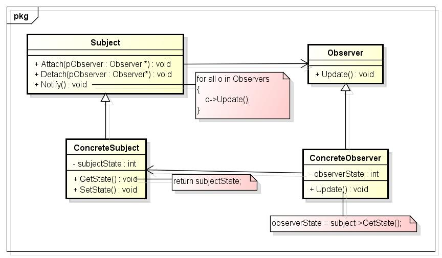

## 观察者模式

观察者模式定义了独享之间的一对多依赖，这样一来，当一个对象改变状态时，它的所有依赖者都会收到通知并自动更新。



Subject（目标）
——目标知道它的观察者。可以有任意多个观察者观察同一个目标；
——提供注册和删除观察者对象的接口。

Observer（观察者）
——为那些在目标发生改变时需获得通知的对象定义一个更新接口。

ConcreteSubject（具体目标）
——将有关状态存入各ConcreteObserver对象；
——当它的状态发生改变时，向它的各个观察者发出通知。

ConcreteObserver（具体观察者）
——维护一个指向ConcreteSubject对象的引用；
——存储有关状态，这些状态应与目标的状态保持一致；
——实现Observer的更新接口以使自身状态与目标的状态保持一致。

观察者模式按照以下方式进行协作：

1.  当ConcreteSubject发生任何可能导致其观察者与其本身状态不一致的改变时，它将通知它的各个观察者；
 2.  在得到一个具体目标的改变通知后，ConcreteObserver对象可向目标对象查询信息。ConcreteObserver使用这些信息以使它的状态与目标对象的状态一致。

```C++
#include <iostream>
#include <vector>
using namespace std;

class IObserver;
class ISubject
{
public:
	virtual void AddObserver(IObserver* observer) = 0;
	virtual void DeleteObserver(IObserver* observer) = 0;
	virtual void Notify() = 0;
};

class IObserver
{
public:
	virtual void Update(int) = 0;
};

class ConcreteSubject : public ISubject
{
public:
	void AddObserver(IObserver* observer)
	{
		if (observer != nullptr)
		{
			m_observerList.push_back(observer);
		}
	}
	void DeleteObserver(IObserver* observer)
	{
		auto index = find(m_observerList.begin(), m_observerList.end(), observer);
		if (index != m_observerList.begin())
		{
			m_observerList.erase(index);
		}
	}
	void Notify()
	{
		for (auto &it : m_observerList)
		{
			cout << "数据更新，准备接收" << endl;
			it->Update(m_data);
		}
	}
	void SetData(int _data)
	{
		m_data = _data;
		this->Notify();
	}
private:
	int m_data;
	vector<IObserver*> m_observerList;
};

class ConcreteObserver : public IObserver
{
public:
	ConcreteObserver(ConcreteSubject* subject) : m_subject(subject), m_data(0)
	{
		m_subject->AddObserver(this);
	}
	void Update(int data)
	{
		m_data = data;
		cout << "更新数据 data = " << m_data << endl;
	}
private:
	ConcreteSubject* m_subject;  //保存对subjec的引用，方便在Observer中注册及注销观察者
	int m_data;
};

int main()
{
	ConcreteSubject* sub = new ConcreteSubject();
	IObserver* obs = new ConcreteObserver(sub);
	sub->SetData(5);
}
```

