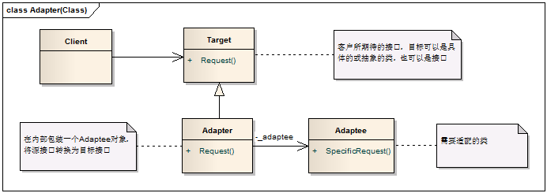

## 适配器模式

适配器模式将一个类的接口转换成客户期望的另一个接口，让原本的接口不兼容的类可以合作无间。



- 目标接口（Target）：所期望得到的接口
- 适配者（Adaptee）：需要适配的类
- 适配器（Adapter）：该模式的核心，具有将 Adaptee 包装为 Target 的职责

### 优点：

- 可以让任何两个没有关联的类一起运行
- 提高了类的复用
- 增加了类的透明度
- 灵活性好

### 缺点：

- 过多地使用适配器，会让系统非常零乱，不利于整体把控。

例如，看到调用的是 A 接口，内部却被适配成了 B 接口的实现，系统如果出现太多类似情况，无异于一场灾难。因此，如果不是很必要，可以不使用适配器，而是直接对系统进行重构。

###  适用场景

当想使用一个已存在的类，而它的接口不符合需求时。

- 你想创建一个可复用的类，该类可以与其他不相关的类或不可预见的类协同工作。
- 你想使用一些已经存在的子类，但是不可能对每一个都进行子类化以匹配它们的接口，对象适配器可以适配它的父接口。


```C++
class Target
{
public:
	virtual void Request() = 0;
};

class Adaptee
{
public:
	void SpecificRequest() {}
};

class Adapter : public Target
{
public:
	Adapter(Adaptee* _adaptee) : m_adaptee(_adaptee) {}
	void Request()
	{
		// 在这个函数里面做些处理，使其表现得跟Target一样，并满足要求
		m_adaptee->SpecificRequest();
	}
private:
	Adaptee* m_adaptee;
};

int main()
{
	Adaptee* adaptee = new Adaptee();
	Target* adapter = new Adapter(adaptee);
	adapter->Request();
}
```

