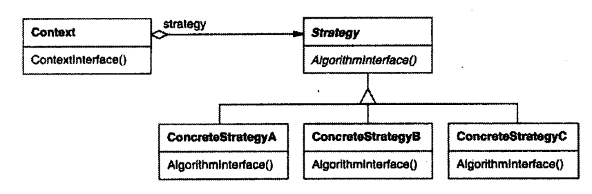

## 策略模式

定义一系列的算法，把他们一个个封装起来，并且使它们可以相互替换。此模式是的算法可以独立于使用它的客户而变化。

#### 模式组成成员

1. Strategy（策略）：定义所有支持的算法的公共接口；Context使用这个接口调用某个ConcreteStrategy定义的算法。

2. ConcreteStrategy（具体策略）：以Strategy接口实现某具体算法。
3. Context（上下文）：包含一个对Strategy对象的指针或引用，并根据ConcreteStrategy对象来配置。

### 使用场景

- 多个类只有在算法或行为上稍有不同的场景。
- 算法需要自由切换的场景。
- 算法使用客户不应该知道的数据。时刻使用策略模式以避免暴露复杂的、与算法相关的数据结构。
- 一个类定义了多种行为，并且这些行为在这个类的操作中以多个条件语句的形式出现。将相关的条件分之移入它们各自的Strategy类中以代替这些条件语句。

